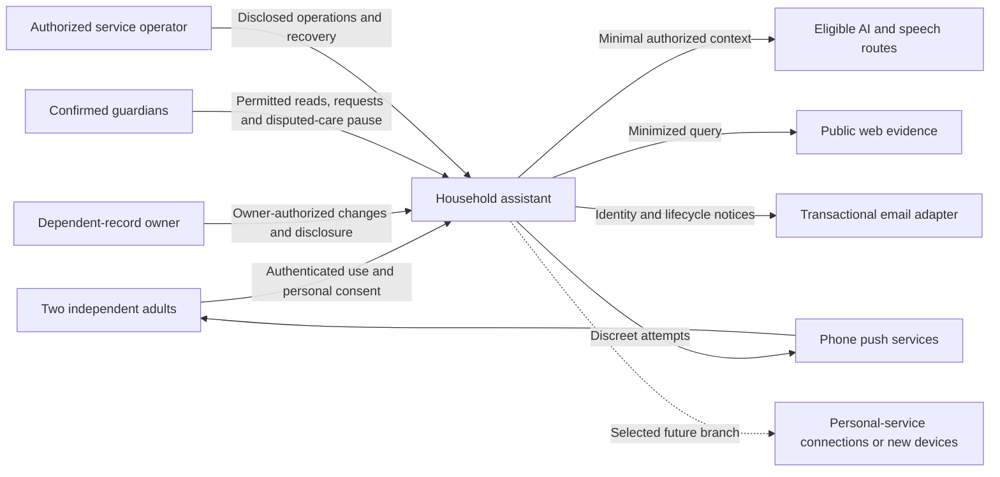
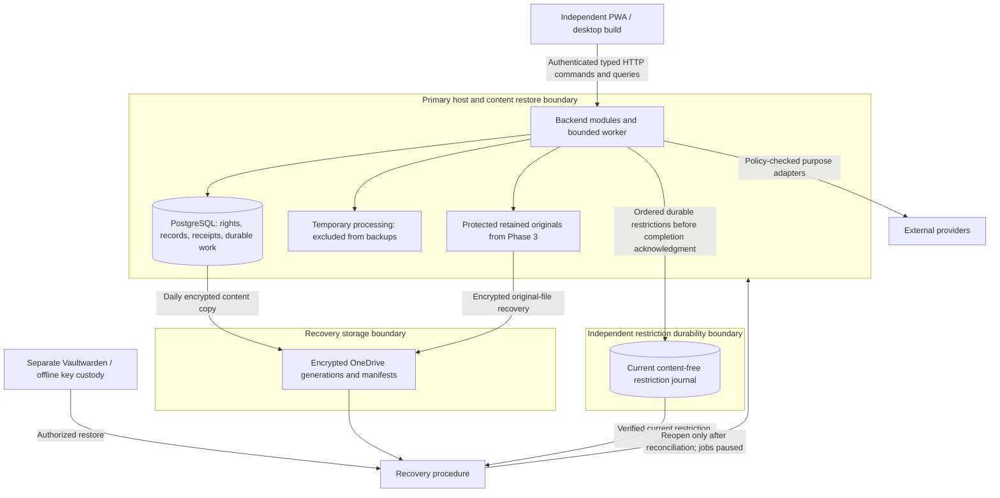

# Architecture

## Status and authority

**Draft; complete architecture approval is pending Nishanth’s review.** Consolidated 3 October 2026. Product requirements are confirmed where their source says so; the mechanisms below are proposed unless an ADR explicitly records a narrower accepted owner direction. Selection and successful validation are separate. [Documentation index](README.md).

This document owns the system shape and dependency boundaries. [Application design](reference/APPLICATION-DESIGN.md), [data/security contracts](reference/DATA-AND-SECURITY.md) and [operations](reference/OPERATIONS.md) contain technical contracts. [ADRs](adr/README.md#decision-index) own rationale; [the stack](TECH-STACK.md) names technologies. File placement and coding conventions belong in the [Noola skill](../.agents/skills/noola-code-structure/SKILL.md). None changes [product rules](reference/PRODUCT-RULES.md#business-rules).

## Structure and boundaries

Use a modular backend with one transactional primary database and an independently built web client. Two adults use a PWA-first client on actual phones and desktop. The backend controls identity, record rights, processing eligibility, approvals, cost admission and execution receipts. Manual operations use those same backend operations. Backend separation and TanStack Router, shadcn/Base UI, TanStack Form and nuqs are owner-selected directions recorded on 4 October 2026; remaining mechanisms are proposed.

Browser-safe schemas describe private HTTP inputs, outputs and errors; generated wire types and runtime validation carry contracts into queries, forms and component props. Backend modules and database representations remain server-only. The web uses TanStack Router with a Vite SPA build; Hono is the backend transport candidate. Initial same-origin serving can assemble both artifacts on a permitted host without coupling their source or releases.

The dependent is a subject of records, not an authenticated actor. Guardianship does not grant owner-level changes or sensitive export. The diagram separates responsibilities, not additional accounts. Infrastructure email supports identity/recovery and content-free notices; user-directed external sending remains outside Release 1. Optional eligible ChatGPT access is an AI connection, distinct from future domain-account integrations.

A restore of an older database must not restore older permissions or deleted content. The current restriction journal has a separate durability/restore boundary; a table on the primary disk or asynchronous recovery-file sync is insufficient. Missing completeness proof keeps restored access closed. Keys and an alternate authorized operator must remain available independently of the primary host. The diagram expresses the selected arrangement to prove, not deployed resilience.

Temporary storage, retained bytes, transactional metadata and current restrictions have different lifecycles. Logical separation does not require a paid service for every category. Isolated untrusted parsing may require its own bounded container; an execution boundary is not automatically a new domain service.

## Module ownership

Each domain owns its records and permits changes through application operations. The [module contracts](reference/APPLICATION-DESIGN.md#module-contracts) define interfaces, dependencies and prohibitions; [traceability](reference/TRACEABILITY.md#requirement-matrix) maps every catalog requirement to a responsible module.

| Module | Primary responsibility |
|---|---|
| Identity and Household Policy | Sessions, membership, grants, guardianship, accepted settings and operation-specific policy |
| Conversation and Actions | Intent, reviewed proposals, revision-bound approvals, per-step execution and receipts |
| Memory and Evidence | Deliberately saved information, approved excerpts, source validity and suppression relationships |
| Lists and Tasks | Shared lists, accepted assignments, attributed revisions, completion and prerequisites |
| Agenda and Plans | Manual events, participation, busy-only projections, reviewed plans and linked changes |
| Communication and Decisions | Approved snapshots, replies, acknowledgment, handovers and individual agreement |
| Scheduling and Delivery | Schedules, occurrences, attempts, inbox entries, eligibility and routine controls |
| Files and Capture | Temporary input, retained originals, reviewed extraction, revisions and capacity |
| Search and Retrieval | Authorized discovery and rebuildable derivatives, with separate manual/AI eligibility |
| AI Orchestration | Constrained context, purpose adapters, output validation and proposals without independent authority |
| Lifecycle and Portability | Authorized export, expiry, removal, exit and deletion-aware recovery |
| Operations and Cost | Redacted health, aggregate accounting, admission, incidents and operating evidence |

Specialist knowledge, administration, care, history, learning, connection and device modules remain selected future branches. Existing general notes, files, handovers and protective rules do not depend on those modules being built.

## Dependency rules and critical invariants

Clients and transport code call application operations. Application operations coordinate domain owners and transactions; providers and persistence sit behind explicit boundaries. Domain modules do not depend on router request objects, browser state or provider response shapes. Cross-domain changes use owner interfaces and shared transaction context where atomic consistency is required.

- Recheck current identity and operation-specific rights before query, context assembly, mutation, export and delivery. Search counts, snippets and busy-only results must not reveal inaccessible records.
- Treat documents, web pages, imported content and model output as untrusted evidence. They cannot confer permission or authenticate a person.
- Bind approvals to actual revisions, recipients and disclosed content. Material changes invalidate approval. A request, acceptance, notification submission, acknowledgment and task completion are distinct states.
- Keep retained records and receipts authoritative. Model prose cannot establish that an action succeeded. Reconcile interrupted submissions before repeating effects.
- Keep processing consent separate from retention, and enforce manual-only exclusions across all derived representations and external purpose adapters.
- Carry provenance and current source state through retrieval, generated output and retraction. Preserve independent contributions only where they do not expose withdrawn content.
- Exclude temporary content from ordinary history and routine recovery. Apply product lifecycle policy before stale derivatives or older backups can re-enter use.
- Serialize cancellation against possible provider handoff. Unknown external outcomes cannot be blindly reclaimed or reported as prevented; queue status does not establish delivery.
- Reserve bounded production paid work atomically. Subscription accounting is separate, but paid-budget exhaustion pauses all optional AI routes, including interactive and background subscription work. No provider switch bypasses the pause or silently changes processor or payer.
- Keep ordinary online controls and saved scheduling usable during AI failure. Source-aware direct agenda fallback does not invent complete calendar coverage.

The [derived requirements](reference/APPLICATION-DESIGN.md#derived-requirements) retain DAR-001–DAR-012 and their product sources. They state necessary technical consequences, without turning every proposed mechanism into a confirmed product requirement.

## Execution, interfaces and state

Authenticated private HTTP bindings serve queries, commands, progress, uploads, downloads, status and callbacks. They call framework-independent backend operations. Shared Zod schemas, generated OpenAPI and client declarations define the proposed wire contract; runtime input/output checks, SQL constraints, current policy and temporal validation remain necessary. This supports independent clients without creating a public API platform.

TanStack Query owns private in-memory remote data; Router loaders prepare the same queries and return no parallel private data cache. TanStack Form owns editable values, nuqs owns allowlisted URL presentation state and React owns ephemeral interactions. One parser definition connects nuqs with Router search validation. Clear queries, route state and drafts at required identity/lock transitions. The [frontend contract](reference/APPLICATION-DESIGN.md#frontend-integration) and [TanStack review](reviews/TANSTACK-AND-UI-REVIEW.md) define integration and validation responsibilities.

A text request moves from authenticated intent through authorized retrieval or a reviewed proposal to domain execution and a truthful receipt. Voice and documents feed this same path after their capture/processing choices and critical-field review. The [system flows](reference/APPLICATION-DESIGN.md#system-flows) preserve correction, reminder acceptance, fresh briefs, export, exit and recovery sequences.

Use strong consistency for authority, approvals, revisions, deduplication, linked state and paid admission. Derivative search/index work may lag, but source-current checks prevent stale or unauthorized use. A plan can yield partial per-record results; no distributed transaction across external providers is promised.

Durable maintenance starts with retained records. Bounded pg-boss work uses authoritative occurrence/attempt state, not private payload copies. Progress can use authenticated SSE, while shared views revalidate after mutation/resume and bounded foreground polling. Raw model token forwarding cannot bypass output checks. No persistent private browser cache, cross-user answer cache or cached permission/budget authority is selected.

## Evolution and evidence

The [roadmap](ROADMAP.md#delivery-sequence) owns phase order. Extend controls whenever a new record or input is enabled. Semantic retrieval may enter early if required recall fails; it must not be postponed simply to make the initial stack smaller. Split execution when runtime limits, contention or parser isolation demand it, while preserving shared domain contracts.

Independent web/backend deployment does not require microservices or separate domain databases. Backend replicas need shared durable coordination, bounded pools and tested races before scaling; worker extraction follows runtime/isolation need. A future mobile client consumes the same contracts and server operations. Distributed caches, event-streaming platforms, enterprise identity, public APIs and commercial tenancy have no current justification. The existing [evolution triggers](reference/APPLICATION-DESIGN.md#evolution-triggers) govern measured growth.

Actual-device delivery, provider eligibility, privacy, recall, cleanup, recovery, cost and independent household value remain unproven. Failed required gates require technical correction or an explicit product change, not a hidden reduction in scope. [The evidence register](reference/DECISIONS-AND-GATES.md#evidence-gates) owns outstanding proof; [ISSUE-01 and ISSUE-02](reference/DECISIONS-AND-GATES.md#open-policy-questions) record Nishanth's resolved budget-exhaustion and nonproduction-provider policies.
