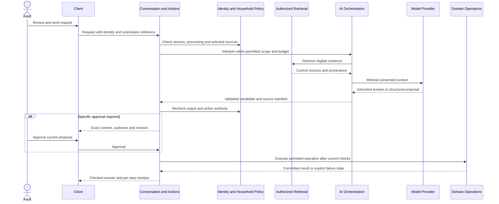
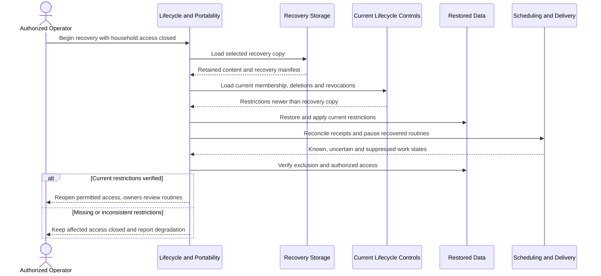

# Application design

Technical contracts for the proposed application. Product behavior is owned by REQUIREMENTS and PRODUCT-RULES; these mechanisms remain subject to architecture review and evidence gates.

[Documentation index](../README.md). Consolidated 3 October 2026; implementation and validation remain pending.

<a id="quality-drivers"></a>
## Quality drivers

[Acceptance criteria](ACCEPTANCE.md#quality-and-evaluation) own numerical targets. The following implications explain the required technical shape.

- **Security and authorization:** Server-validated identity and current rights apply to all entry points, including jobs and exports. No client, model, file, or notification establishes authority. Derived outputs carry source and audience constraints.
- **Privacy and retention integrity:** Separate processing from persistence, and manual access from AI use. Keep provenance for known derivatives and content-free removal controls. Exclude temporary data from routine recovery copies and redact telemetry by default.
- **Reliability and data integrity:** Commit record changes and corresponding receipts consistently. Persist scheduling state, reconcile unknown outcomes, and order cancellation against submission. Recover from authoritative records without replaying actions blindly.
- **Availability and manual continuity:** AI, speech, and web work are optional dependencies of individual operations. Authentication, manual reads and writes, privacy controls, export, and ordinary saved reminders have independent execution paths. Briefs have a deterministic current-agenda fallback.
- **Performance and responsiveness:** Bound context, processing duration, retries, and response size. Isolate long work from interactive capacity. Expose progress and cancellation without requiring unchecked token streaming.
- **Evidence quality:** Preserve source references, dates, attribution, validity, and uncertainty. Retrieval and generation are independently evaluated. Historical values, independent preferences, and unconfirmed agreement remain distinguishable.
- **Accessibility and independent use:** Every authoritative record and control is reachable outside chat. Text, keyboard, assistive labels, sound-free use, and readable enlargement are client responsibilities. Identity and audience remain visible during capture and action review.
- **Cost efficiency, maintainability, and extensibility:** Prefer one deployment and database; reserve variable cost before external work; add adapters only at real integration boundaries. Keep domain responsibilities cohesive so later modules reuse authority and lifecycle rules.
- **Durability, portability, and bounded scale:** Retained records require recoverable persistence, authorized original exports, and deletion-aware restore. Primary-store search is the initial proposal, subject to representative-load evidence.

<a id="module-contracts"></a>
## Internal Application Architecture

The following names define logical ownership. They do not mandate folders, independently deployed services, or a framework abstraction for every operation. Future modules are architectural homes only until selected.

### Identity and Household Policy

**Responsibility:** Independent authentication, memberships, guardianship, audience policy, consent, device revocation, household rules, and adult preferences.

**Owns:** Identity and relationship aliases, session authority, grants, accepted settings, processing choices, and guardian confirmations.

**Exposes:** Current principal and membership checks; action-specific policy decisions; approved presentation settings; consent and grant lifecycle operations.

**Depends On:** Protected identity persistence and the selected authentication mechanism; content-free audit recording.

**Must Not Depend On:** AI interpretation for authentication or authority; private record contents to grant coordinator privileges. It does not decide task completion or snapshot semantics.

**Relevant Product Capabilities:** ACC, PER, CHD-01/CHD-06/CHD-10; BR-001–BR-005, BR-007.

**Roadmap Introduction:** Phase 1 after Phase 0 feasibility; extend for each processing operation, Phase 4 planning preferences, and selected Phase 10 roles.

### Conversation and Actions

**Responsibility:** Multi-turn interaction, explicit intent submission, focused clarification, exact proposals, approvals, stop, and compound-action coordination.

**Owns:** Conversation history under its selected retention, proposal revisions, action execution state, and per-step receipts. Recipient acceptance stays with the relevant domain.

**Exposes:** Submit or revise intent, inspect/approve a current proposal, cancel unstarted work, reconcile a request, and open resulting authoritative records.

**Depends On:** Identity and Household Policy, AI Orchestration for interpretation, and enabled domain operations for execution.

**Must Not Depend On:** Model text as evidence that an action happened; direct writes to another domain's records; transcript retention as a prerequisite for a separately approved action.

**Relevant Product Capabilities:** CON-01–CON-08, CON-10; FR-007–FR-008; BR-010, BR-012.

**Roadmap Introduction:** Phase 1 for enabled actions; extend through Phase 5; optional topic spaces and research in Phase 7.

### Memory and Evidence

**Responsibility:** Deliberate facts, notes, approved source excerpts, validity, attribution, correction, contradictions, and controls on AI use.

**Owns:** Saved memories, current/historical relationships, approved evidence references, personalization exclusions, and visible forgetting controls.

**Exposes:** Save reviewed information, inspect evidence, correct/supersede, forget or reauthorize, and query permitted facts.

**Depends On:** Identity and Household Policy, authorized evidence-source queries, and its own persistence. Lifecycle invokes its retention/removal operations; Memory does not call back into that coordinator.

**Must Not Depend On:** Raw history as automatic personalization, embeddings as authoritative facts, or generation as proof of shared agreement.

**Relevant Product Capabilities:** MEM; HOM-08; JRN-06; generic authorized sensitive records under WEL-06 and CHD boundaries.

**Roadmap Introduction:** Phase 1; file evidence in Phase 3; structured decisions in Phase 4; selected suggestions/imports/review in Phase 7.

### Lists and Tasks

**Responsibility:** Attributed shared lists, personal/shared tasks, assignment requests, acceptance, completion, and recurring chore occurrences.

**Owns:** Lists, items, task revisions, assignee responses, completion history, subtask and prerequisite relationships.

**Exposes:** Authorized edits, assignment decisions, lifecycle transitions, current task queries, and changes requiring linked reminder suppression or review.

**Depends On:** Identity and Household Policy and its own transactional persistence. The application operation coordinates linked changes with Scheduling and Delivery atomically.

**Must Not Depend On:** Notification opens or AI inference as completion; plan approval as another adult's acceptance; direct provider calls.

**Relevant Product Capabilities:** TSK; BR-004, BR-011–BR-013.

**Roadmap Introduction:** Shared lists in Phase 1, complete task/request behavior in Phase 2, recurrence and plan relationships in Phase 4.

### Agenda and Plans

**Responsibility:** Entered events, participation, explicit busy-only grants, overlap checks, planning constraints, and reviewed multi-record changes.

**Owns:** Event revisions, timing and participation state, busy-only projections, plan versions and links to independently owned records.

**Exposes:** Authorized agenda and busy queries, event changes, plan diffs, and reviewed record-change proposals.

**Depends On:** Identity and Household Policy, authorized task/evidence queries, and validated approval values. Application operations coordinate resulting task and schedule changes; Agenda does not call back into Conversation and Actions.

**Must Not Depend On:** An external calendar for the manual agenda; private event metadata in busy projections; automatic rewriting of accepted commitments.

**Relevant Product Capabilities:** CAL; TSK-08; PER-06; FR-007.

**Roadmap Introduction:** Phase 4; selected external calendars in Phase 9 after their distinct gates.

### Communication and Decisions

**Responsibility:** In-app messages, selected excerpts, replies, explicit acknowledgment, dated handovers, and individual agreement on decisions.

**Owns:** Sent snapshots, correction/retraction relationships, independent replies, decision revisions, and each adult's confirmation.

**Exposes:** Send permitted exact content, review composed disclosure, correct/retract a snapshot, reply/acknowledge, and confirm one's own agreement.

**Depends On:** Identity and Household Policy; approved source-owner interfaces; Scheduling and Delivery for inbox alerts; action approval contracts.

**Must Not Depend On:** Live source mutation to rewrite sent content; read permission alone for onward disclosure; passive reads as acknowledgment.

**Relevant Product Capabilities:** COM; BR-003–BR-004, BR-011; F05.

**Roadmap Introduction:** Messages in Phase 2; general handovers and decisions in Phase 4; shared-activity digest in Phase 5.

### Scheduling and Delivery

**Responsibility:** Accepted schedules, temporal rules, occurrences, notification attempts, recipient interruption controls, brief schedules, and direct agenda fallback.

**Owns:** Reminder/routine configuration, occurrence and attempt state, inbox delivery records, device-channel status, and recipient-local snoozes. Message content remains Communication-owned.

**Exposes:** Schedule only authorized work, pause/cancel/reconcile, inspect outcomes, query due work, and deliver currently authorized content.

**Depends On:** Identity and Household Policy; current source-domain queries; push adapter; Operations and Cost. Generated briefs additionally use AI Orchestration.

**Must Not Depend On:** Open chat, model availability for ordinary reminders, or a sender's preference overriding recipient controls. A delivery attempt cannot complete a task.

**Relevant Product Capabilities:** REM, PRO, COM-08; [Notifications and Communication](PRODUCT-RULES.md#notifications); BR-012–BR-013.

**Roadmap Introduction:** Phase 2 reminders/inbox, Phase 4 recurrence and event offsets, Phase 5 briefs/digest; selected watches, routines, follow-ups, and timers in Phase 8.

### Files and Capture

**Responsibility:** Supported upload validation, temporary analysis, separately retained originals, reviewed extraction, voice capture processing, and short-lived media cleanup.

**Owns:** File metadata and revisions, extraction drafts, transient media processing state, and links from confirmed fields to sources.

**Exposes:** Analyze under consent, save an opaque or analyzed original, review fields, replace a file, transcribe a recording, and retrieve an authorized original.

**Depends On:** Identity and Household Policy, protected/temporary storage, and AI Orchestration's processor controls. Lifecycle invokes its cleanup operations; approved follow-through uses application operations owned by the target domain.

**Must Not Depend On:** Saving an original as blanket consent to retain extraction; Stop as Send; file instructions as authority.

**Relevant Product Capabilities:** DOC, VOI; FR-002–FR-003; JRN-06 for original media.

**Roadmap Introduction:** Phase 3; event-linked extraction actions extend in Phase 4; selected live input in Phase 10.

### Search and Retrieval

**Responsibility:** Authorized cross-domain discovery and source-backed context selection, with distinct manual search and AI-retrieval eligibility.

**Owns:** Rebuildable search representations and retrieval execution state, not canonical source records or permission policy.

**Exposes:** Filtered manual discovery, requested history recall, eligible context retrieval, and accessible citations with revision/validity information.

**Depends On:** Current identity/policy decisions and authorized queries from source-owning domains; optional permitted embedding computation if justified.

**Must Not Depend On:** Index permissions as the final authority; unfiltered global counts; forgotten content as AI context; automatic use of raw historical chats.

**Relevant Product Capabilities:** SRC-01–SRC-03, SRC-07; MEM-05, MEM-13; DOC-08.

**Roadmap Introduction:** Phase 1 for available records; files in Phase 3, decisions in Phase 4; selected cross-source work in Phase 7 and visual search in Phase 10.

### AI Orchestration

**Responsibility:** Bounded interpretation/generation, authorized context assembly, prompt versions, structured proposals, web evidence acquisition, output validation, and evaluation hooks.

**Owns:** Execution configuration, model/prompt versions, source manifests, and redacted inference outcomes. It does not own household truth or commitments.

**Exposes:** Generate with approved context, interpret a request into validated proposals, transcribe/analyze under operation-specific consent, and report progress/cancel state.

**Depends On:** Identity and Household Policy; Search and Retrieval; source-domain read contracts; Operations and Cost; purpose-specific provider adapters.

**Must Not Depend On:** Unrestricted database access, provider-held conversation state as the only history, or a model's own permission claims. It returns proposals rather than calling privileged domain writes itself.

**Relevant Product Capabilities:** CON, PER-03, SRC-04–SRC-06, VOI, DOC, PRO, and selected future generation.

**Roadmap Introduction:** Text interpretation/recall in Phase 1, richer input/web in Phase 3, plans in Phase 4, briefs in Phase 5.

### Lifecycle and Portability

**Responsibility:** Cross-domain retention, export, removal, recovery, and membership-exit coordination while preserving each domain's rules.

**Owns:** Export job/download state, cleanup state, recovery manifests, content-free deletion/revocation controls, and removal scope/outcome records.

**Exposes:** Authorized export, expiry/removal coordination, restore readiness checks, and lifecycle operations through each record owner.

**Depends On:** Identity and Household Policy; domain-specific lifecycle interfaces; protected storage; restricted operator execution.

**Must Not Depend On:** Old backups as current authority, AI availability for export/deletion, or broad database deletion that bypasses joint ownership and source distinctions.

**Relevant Product Capabilities:** CTL, MEM-15/MEM-17; FR-004–FR-005; BR-005, BR-008–BR-009.

**Roadmap Introduction:** Phase 1 for enabled records; mandatory extensions before each new record type is usable.

### Operations and Cost

**Responsibility:** Cost admission/reservation, bounded resource execution, service health, redacted telemetry, restricted audit recording, and incident suspension.

**Owns:** Cost reservations/reconciliation, aggregate daily totals, operational health, and content-minimized action/security metadata under applicable retention.

**Exposes:** Reserve/reconcile variable work, inspect aggregate budget, pause optional AI, record permitted operational events, and report recovery degradation.

**Depends On:** Current configuration authority, transactional persistence, adapter usage outcomes, and recovery health.

**Must Not Depend On:** Prompt bodies or private action metadata for coordinator reporting; AI to decide whether its own use can be paused.

**Relevant Product Capabilities:** CTL-07–CTL-09; QLT-11; [Product Constraints](PRODUCT-RULES.md#operating-constraints), [Risks and Product Challenges](PRODUCT-RULES.md#risks-and-incidents).

**Roadmap Introduction:** Phase 1 with Phase 0 cost evidence; extend through Phase 5; validate ongoing cost/maintenance in Phase 6.

### Selected future modules and integrations

**Responsibility:** Provide separately selected specialist capabilities without expanding general Release 1 records by implication.

**Owns:** Home knowledge/assets/inventory; lightweight administration; voluntary wellbeing and dependent-care records; family history/journaling; learning plans, each within its own selected domain. Connections owns selected account grants, credentials, sync health, and observed external outcomes.

**Exposes:** Authorized specialist queries and proposals through existing record, evidence, approval, scheduling, and lifecycle contracts. A selected device adapter exposes only explicitly enabled actions.

**Depends On:** Relevant core domains and product-specific activation evidence. Account reads precede selected writes; outbound-only channels have their own gate without an invented inbound feature.

**Must Not Depend On:** Blanket access to household data, completion inferred from delivery, connection as approval to act, or caregiver access as implicit guardianship.

**Relevant Product Capabilities:** HOM-01–HOM-07, ADM-01–ADM-05, WEL-01–WEL-05, CHD-02–CHD-05, JRN-01–JRN-05, LRN, INT, HME and selected conditional inputs/roles.

**Roadmap Introduction:** Knowledge extensions in Phase 7; selected specialist domains in Phase 8; Connections in Phase 9; selected roles/devices in Phase 10. No generic plugin platform is required.

<a id="dependency-rules"></a>
## Dependency Rules

Dependencies follow responsibilities rather than an obligatory framework layering scheme:

```text
Clients and background entry points
    -> authenticated application operations
    -> domain-owned rules and current policy checks
    -> domain persistence and purpose-specific external adapters

AI Orchestration -> authorized queries and validated proposals
Conversation and Actions -> domain operations for permitted execution
External providers -> observations only, never application authority
```

Domain rules do not import provider SDK concepts or require generation. Adapters implement application-owned contracts and translate provider results into explicit observed states. A common identity/policy vocabulary is justified; a universal generic record engine or abstraction around every function is not.

Cross-domain orchestration belongs in application operations. For example, a task completion operation applies Lists and Tasks rules and suppresses Scheduling and Delivery work in one local transaction. The scheduling runner reads the committed state rather than synchronously calling back into the task operation. This avoids circular orchestration while preserving both domain owners.

Search reads source-domain projections and checks current authority. Lifecycle invokes record owners for deletion and export rather than duplicating their rights. Modules must not write another module's records directly, use shared storage to bypass policy, or broaden permissions when producing a derivative. Technical notifications within the process are permissible; they do not justify a broker or replacing transactional consistency with eventual events.

<a id="system-flows"></a>
## Primary System Flows

### Independent authentication and session control

1. **User trigger:** An adult signs in, accepts their own settings, changes devices, or revokes a session. Before authentication, only sign-in and generic help are visible.
2. **Responsible modules:** Identity and Household Policy authenticates the principal and checks current membership/device authority. Clients display the active identity and audience.
3. **Data access:** Load only that principal's authorized profile and settings. Household and guardian agreements preserve each adult's acceptance separately.
4. **External calls:** Only the selected authentication mechanism, if external. Neither speech nor model recognition authenticates the adult.
5. **Response:** Authorized direct controls become available. Shared devices lock after five minutes of inactivity or backgrounding; personal devices lock after fifteen minutes of inactivity. Logout and profile switching clear prior visible/session state.
6. **Failure behavior:** Failed, revoked, or expired authority yields no household content or existence signals. Revocation denies new server access immediately after confirmation. Disconnected-device erasure is not promised; recovery cannot expose another adult's private records.

### Text capture, evidence-based recall, and permitted action

1. **User trigger:** An authenticated adult sends text, asks to remember a fact, or requests recall. An offline draft requires explicit review and Send after reconnection.
2. **Responsible modules:** Conversation and Actions establishes the audience and intent; Identity and Household Policy checks processing/retention choices; AI Orchestration interprets using Search and Retrieval and relevant domain queries.
3. **Data access:** Retrieve only eligible current sources. Past conversations require explicit recall or selection. Temporary context excludes saved facts unless separately enabled. Reconcile matching prior submissions and apply source revisions, forgetting, and no-external-AI exclusions.
4. **External calls:** Reserve bounded variable cost before any permitted model call. Send minimal context through the disclosed adapter; no model call is needed for a direct manual save.
5. **Response:** Return supported answers with accessible evidence or validated proposals. Execute only authorized actions, with the source action-class approval rules, and return per-step receipts linked to authoritative records.
6. **Failure behavior:** Ask only for consequential ambiguity; isolate the uncertain part of a mixed request. Abstain without sufficient evidence. Stop unstarted actions on cancellation. Preserve successful steps and reconcile unknown outcomes rather than repeating them. Offer manual control during AI failure or budget pause.



The diagram includes a write only when requested. A read-only answer ends after output checks; interpretation does not automatically create memory or a commitment.

### Directed reminder, acceptance, and delivery

1. **User trigger:** One adult asks for the other to receive a reminder, or the recipient accepts a pending request.
2. **Responsible modules:** Conversation and Actions routes the request; Identity and Household Policy checks sender/recipient authority; Scheduling and Delivery owns acceptance-dependent scheduling and attempt state. Lists and Tasks participates only when a task is explicitly requested or converted.
3. **Data access:** Save request content, resolved absolute time/timezone, recipient, consent basis, and receipt. Until recipient acceptance or a matching standing rule, no active recipient schedule exists. Durable due state survives chat closure and process restart.
4. **External calls:** At delivery, recheck current eligibility, recipient settings, linked record state, and quiet/late policy before push submission. Serialize cancellation and the submission boundary through the authoritative application state; see [Asynchronous Processing](APPLICATION-DESIGN.md#durable-execution).
5. **Response:** The recipient sees an inbox item and observed delivery state. The sender sees only permitted request outcomes. Snooze, device failures, passive reads, and private settings remain recipient-local.
6. **Failure behavior:** Cancellation confirmed before submission prevents the attempt. Already-submitted notifications may still arrive and open the current record state. Unknown submissions are reconciled before retry. Apply bounded retries and missed-item rules; acknowledgment never completes a task.

### Reviewed voice and document follow-through

1. **User trigger:** An adult explicitly records audio or uploads supported content, selecting processing and retention choices.
2. **Responsible modules:** Files and Capture validates input and handles transient state; AI Orchestration controls processors; Conversation and Actions handles submitted transcript or confirmed extracted actions.
3. **Data access:** Audio, temporary uploads, extraction drafts, retained originals, and resulting facts/actions have independent lifecycle and consent. Saving an original does not approve its extracted fields. Retained revisions flag linked records for review.
4. **External calls:** Transcription requires consent before recording; Stop does not authorize a later action. File analysis, OCR, and speech are subject to operation-specific disclosure, no-external-AI exclusion, and cost admission.
5. **Response:** Stop displays an editable transcript and waits for Send. File analysis provides page/region/excerpt evidence where feasible, visible uncertainty, and separately reviewable retention and action outcomes.
6. **Failure behavior:** Unsupported analysis allows an opaque save within limits. Unsupported/oversized input is explained before processing. Unclear critical fields pause affected actions. Cancellation and deadlines clean transient content; manual input remains available. Embedded instructions never cause a privileged action.

### Correct, forget, withdraw, or remove information

1. **User trigger:** An adult corrects a fact, disables personalization, forgets it, deletes a source, withdraws a grant, or requests removal everywhere.
2. **Responsible modules:** The source-owning domain applies its rights; Memory and Evidence controls future AI use; Lifecycle coordinates known derivatives, storage, and recovery suppression; Scheduling and Delivery suppresses affected future output.
3. **Data access:** Inspect only authorized matches and provenance links. Preserve independent records, contributions, and sent-snapshot distinctions. Record current exclusions before allowing later reads or generation; index cleanup may follow.
4. **External calls:** Local authority changes do not depend on a model. Remove service-managed copies through storage interfaces. Provider processing retention and external downloads retain their disclosed limitations.
5. **Response:** Present the actual changed value, excluded uses, removed matches, inaccessible scope limits, and available snapshot retraction choices. Material sent-content corrections require explicit linked corrections rather than silent rewriting.
6. **Failure behavior:** Keep removed/revoked information excluded while cleanup retries. If current exclusion cannot be enforced, suspend the affected capability. Do not claim semantic erasure of undiscovered paraphrases or external copies. Recipient-saved snapshot handling remains AD-004.

### Fresh brief with direct fallback

1. **User trigger:** An adult enables a private or shared daily/weekly brief with chosen sources, audience, schedule, and interruption settings.
2. **Responsible modules:** Scheduling and Delivery controls the routine; Agenda and Plans and Lists and Tasks supply current records; AI Orchestration optionally generates commentary.
3. **Data access:** Use selected saved facts and structured records, never unselected historical chats. Prepare within fifteen minutes before scheduled delivery, tracking source revisions and generation time.
4. **External calls:** Reserve cost for any permitted generation. Immediately before notification submission, recheck audience permissions and source revisions. Use push only within recipient budgets and timing rules.
5. **Response:** Deliver useful current content with evidence/freshness and pause controls. Changed sources require regeneration or a clearly labeled direct current agenda summary.
6. **Failure behavior:** AI failure or budget pause uses the non-AI summary. Missing/unavailable sources are not reported as empty. Apply the two-hour brief lateness limit, then record a miss and skip to the next run. Confirmed pause prevents unstarted work.

### Authorized export, exit, and recovery

1. **User trigger:** An adult exports or leaves, or an authorized operator initiates recovery after loss.
2. **Responsible modules:** Lifecycle and Portability coordinates record owners and Identity and Household Policy. Operations and Cost reports recovery health; Scheduling and Delivery reconciles restored work.
3. **Data access:** Export permitted originals and structured records with source restrictions. Exit revokes future sessions, grants, approvals, and owned routines while preserving the remaining adult's contributions. Restore uses recovery content plus newer membership, deletion, and revocation control state.
4. **External calls:** Protected storage and the selected identity mechanism only as needed. Ordinary export and recovery do not require generation or expose another adult's private information to the coordinator.
5. **Response:** An authenticated export with manifest expires after 24 hours. Restore reopens access only after current restrictions are applied; recovered routines remain paused, and uncertain actions are reconciled with receipts.
6. **Failure behavior:** Missing originals appear in the manifest. If current restore restrictions cannot be established, keep affected access closed. An old recovery copy marks recovery degraded and pauses new sensitive retention. Guardian-sensitive export and last-guardian exit remain subject to AD-001 and AD-006.



<a id="ai-orchestration"></a>
## AI Architecture

### AI Orchestration Boundary

AI Orchestration receives an authenticated, policy-constrained operation. It interprets submitted intent, assembles permitted context, invokes approved processors within budget, validates outputs, and returns answers or action proposals. The application owns execution and records actual results. There is no autonomous general-purpose agent with unrestricted household access.

A Proposed operation context carries principal, output audience, selected sources, processing/retention permissions, current source revisions, cancellation state, and bounded cost/time allowance. These are conceptual interface obligations, not a wire schema. DAR-002, DAR-003, and DAR-007 explain their necessity.

### Model Provider Abstraction

Use purpose-specific interfaces for generation, structured interpretation, transcription, speech, and any image/document analysis. Record which processor/configuration each operation uses, its capability and retention limits, and its actual outcome. Providers are replaceable without erasing those differences.

Subscription-first ChatGPT access and a configurable Vercel AI Gateway fallback are selected. Paid fallback requires a specific choice or a previously authorized narrow rule and funded owner-approved budget. Each operation records the principal, account, billing route, purpose and allowed provider set. Shared routines name the consenting adult whose connection funds them; never use a different adult's subscription on failure. No fallback may silently switch to an undisclosed processor or a weaker production retention setting. A provider-side conversation store must not become the sole record of household history or permission. Local AI is not a Release 1 promise.

Environment eligibility follows [BR-007](PRODUCT-RULES.md#br-007). Development/testing/staging/UAT may evaluate any available model or processor in any affordable available region without production residency, no-training qualification or thirty-day processor-retention eligibility gates. Provider access/terms, permissions, manual-only controls, funding approval and informed consent for real data still apply; production qualification is separate.

The primary subscription candidate is an isolated Codex SDK runtime using native per-adult ChatGPT authentication. Buffer and validate results before delivery; prove tool restrictions, account/thread separation and retained-history cleanup in the spike. Unsupported modalities require separately qualified purpose adapters. The newer OAuth/Responses plan-sharing flow is deferred, and its HTTP parameter restrictions must not be assumed to describe Codex SDK behavior. See [AI Stack](#provider-contracts).

### Prompt / Instruction Management

Treat application instructions as versioned configuration tied to evaluation results. Separate trusted application instructions, explicit member requests, and untrusted evidence. Presentation preferences can affect language and detail, not facts or authority. Prompt instructions reinforce controls; server policy remains authoritative even if the model ignores them.

### Context Assembly

Context assembly follows the requested purpose and complete output audience:

- Use current conversation context under its processing choice; previous retained conversations are searched only on explicit recall or source selection.
- Use saved facts and authorized structured lists, tasks, events, and decisions for permitted automatic context. Personalization-disabled facts stay out of unsolicited use.
- In a new temporary session, using existing saved facts starts off until explicitly enabled.
- Exclude forgotten material from all AI retrieval, including requested history. Exclude no-external-AI content and derived representations from every external processing step.
- Require every participant to be eligible for shared conversation sources, unless an authorized owner approves the actual excerpt for disclosure. Reading another person's shared private-origin record does not authorize onward sharing.
- Include source references, authors, known effective/recorded dates, current/historical state, and contradictions. Do not invent missing dates or agreement.

Apply source eligibility before sending text to rerankers, embedding processors, speech services, or models. Recheck at delivery so revoked or corrected sources cannot survive in prepared output. The source manifest supports these checks without becoming a separately retained copy of source content.

### Streaming

Progress reporting and cancellation are required. Token-by-token answer delivery is Proposed, not an explicit product requirement. Start with progress followed by a checked answer when output contains household evidence. An optional stream may release only content that has passed applicable audience, source, disclosure, and safety checks, with current authority checked for subsequent delivery. Raw provider tokens are never passed through as trusted household content.

Stopping generation and stopping action execution are distinct. Already committed or submitted outcomes remain visible. A broken stream does not prove an action failed and must not cause blind regeneration of executed steps.

### Tool Execution

Tools are an allowlisted view of enabled application queries and action proposals, not arbitrary code, shell, database, or browser control. The application validates operation type, referenced records, intended recipient/time, and revision. It rechecks permission before each step and applies the source approval class.

Low-risk authorized personal updates and shared-list edits may execute with receipts and required undo behavior. Cross-member work becomes a request unless recipient standing consent matches. Composed messages, new disclosure, sensitive retention, and destructive operations require the specified review. Unsupported external sending, booking, spending, and physical control remain unavailable even after a user says yes.

### Retrieval

Search and Retrieval selects eligible source candidates and returns inspectable evidence. AI may explain those candidates but cannot invent citations. Household evidence and current web evidence remain distinct. Query expansion, reranking, or embeddings are optional mechanisms subject to the same processing restrictions and evaluated quality needs.

### Memory

Memory belongs to Memory and Evidence, not model-provider state or hidden prompt summaries. Release 1 saves facts explicitly. Conversation retention, memory capture, automatic personalization, and requested history recall are separate controls. Phase 7 suggested/automatic low-risk capture requires its own opt-in and selection gate; it is not activated by having a retrieval index.

### Structured Outputs

Validate proposed actions against the supported domain operation and current state, not merely a syntactically valid object. Critical names, amounts, times, and recipients with uncertain interpretation remain reviewable. Return partial/unknown outcomes explicitly. Application receipts, rather than model prose, determine whether an action was saved or submitted.

### Safety and Validation

Sensitive-mode selection is available before capture. Likely sensitive ordinary input pauses before transmission or durable retention; recognized secrets are redacted. Detection is a fallible safeguard and cannot retroactively undo consented transcription.

Validate source references, rights, critical fields, generated-content labels, and proposed effects. Do not use AI to authenticate a voice, infer mental state, establish a diagnosis, invent household consensus, or overrule the adult's pause controls. Prompt injection tests cover documents, images, web pages, imported content, and model tool proposals.

### Retry / Fallback

Bound retries by remaining time, cancellation, eligibility, and reserved cost. Retry a safe generation only while its context remains current; do not repeat completed domain actions. Reconcile uncertain external effects first. Fallbacks are authorized manual access, editable drafts, explicit uncertainty, and direct agenda briefs. A processor switch requires existing applicable consent and compatible guarantees.

### Cost and Token Controls

For production paid/API work, atomically reserve a conservative maximum against the remaining monthly allocation, including bounded response size, processing duration, and permitted retries. Context selection must fit this allowance. Admission for concurrent interactive and background work uses the same ledger. Reconcile actual usage without treating missing or delayed provider accounting as zero.

When the paid variable AI allocation is exhausted, enforce a shared household pause on all optional AI features across paid and subscription routes. Both interactive and background admission check this state before new AI work, including speech, AI research, embeddings, file analysis and generated routines. Subscription quotas remain separately accounted but cannot bypass the pause; never switch routes to evade it. Resume new work only with an available next-month allocation or an owner-approved increase and current consent/eligibility checks. A future local model requires separate selection and validation, not an automatic fallback. Development/UAT monitors cost before production caps are calibrated. Preserve baseline manual functions and direct briefs. Coordinator reports show aggregate daily costs without private prompt/action metadata. No provider quotation or workload feasibility is claimed here; AD-013 gates that evidence. [ISSUE-01](DECISIONS-AND-GATES.md#issue-01) records the owner-approved policy.

### AI Observability

Record operation category, model and prompt version, allowed source references where authorized, latency stages, token/cost estimates and reconciliation, validation outcomes, cancellation, and fallback cause. Default logs exclude bodies, raw media, secrets, and private excerpts. Minimize or restrict identifiers that would reveal private activity.

Evaluate retrieval and end-to-end answers against QLT-04, including current/outdated facts, conflicts, similar names, dates, forgotten content, deleted sources, and inaccessible records. Keep each language mode's speech results separate. A forbidden disclosure blocks the capability regardless of average quality. Pending evidence is tracked in the decision and gate register.

<a id="api-contracts"></a>
## API and Integration Architecture

### Internal application APIs

Clients call authenticated application commands and authorized queries over protected transport. Direct controls, conversation-originated proposals, and background execution use the same domain rules. The client supplies intent and expected revision, not authoritative ownership, permission, or successful-execution claims.

Conceptual interfaces distinguish the principal, action, source/target records, output audience, approval revision, and request identity where relevant. Responses distinguish saved state, pending approval/acceptance, partial failure, and outcome unknown, with links to authoritative records. No endpoint inventory or public wire schema is specified.

Use stable request identity for retrying the same submitted intention. A deliberate new intention receives a distinct identity. Do not deduplicate by natural-language similarity alone. An ambiguous repetition requires clarification. Source revisions and request capture time survive retries so old approvals and relative times are not silently renewed.

### Public API requirements

There is no confirmed public developer API, commercial signup API, or third-party extension platform. Client-facing application interfaces are private product interfaces. A later client can reuse them only within established authentication, audience, and lifecycle rules.

### External service adapters

Own purpose-specific contracts for model generation, speech, file analysis if external, web evidence, push, and protected storage. Adapters translate provider errors and observed outcomes without making provider submission equivalent to receipt or completion. One provider may implement several contracts, but each operation still has its own consent and cost check.

Release 1 has no external personal-account writes. Selected Phase 9 Connections separates reading, importing, health, disconnect, retained copies, and specifically approved writes. A write approval covers the exact account, recipient, content, and revision. External task synchronization, event triggers, and a specialist finance connection remain evaluation-only until RD-011 supplies the missing product contract.

### Webhook handling

No generic webhook platform is needed initially. If a selected push/authentication provider requires a callback, validate its origin and replay protection, map it to an expected operation, and update only the permitted observed state. Later connection webhooks use the same boundary. A callback cannot grant household permission, renew an expired approval, or imply task completion.

### Authentication, retries, idempotency, and failures

Keep service credentials and future member-account credentials server controlled. Use bounded timeouts and retry only safe operations within current authority and cost reservations. Where a provider supports idempotency or status queries, adapters use those features; where it does not, preserve uncertainty and seek reconciliation instead of blindly repeating consequential effects. Do not promise exactly-once external delivery.

<a id="progress-and-realtime"></a>
## Realtime and Streaming Architecture

### Conversation progress and optional answer streaming

An interactive request returns local feedback and then server progress or an actionable state within the source targets. Progress is associated with the current request, while committed action state is durable and separately queryable. A connection lasts only while the authenticated foreground operation needs it; disconnecting does not erase a receipt or imply rollback.

Answer streaming is Proposed and must satisfy [AI Architecture](APPLICATION-DESIGN.md#ai-orchestration) delivery checks. Sequence any released segments within the request, distinguish provisional output from committed action status, and stop subsequent delivery when the session or source authority is revoked. Reconnection obtains current operation state; byte-for-byte stream replay is not a product requirement. Authenticated SSE is selected for progress. Provider SSE is consumed privately and does not authorize raw household-token forwarding.

### Shared-record and acknowledgment updates

Both adults need current authorized list/task state, and acknowledgment must update the recipient's authorized devices. Start with refresh on successful mutation, foreground/resume, and bounded polling while the relevant view is active. This is Proposed; no collaborative text editor, presence service, CRDT, or permanent bidirectional connection is required by TSK-06.

Server revisions determine ordering. Stale writes return a recoverable conflict; changes to different list items preserve both adults' work. Every refresh remains permission filtered. If polling cannot meet observed interaction needs, lightweight server invalidation is Trigger-Based, without sending private content in unauthenticated signals.

### Push and notifications

Push is asynchronous best-effort transport from Phase 2. The app may be closed or locked, so a live application connection cannot be the reminder delivery mechanism. Payloads are discreet; opening requires the correct authenticated adult and reads current state. Late or out-of-order pushes never overwrite current task or occurrence state. Provider delivery uncertainty remains distinct from inbox persistence and explicit acknowledgment.

Push starts off until device permission and a test succeed. Default interruption limits allow at most one routine-generated brief push and one nonessential shared-activity digest push per day; additional routine pushes need explicit recipient configuration. Accepted reminders and incoming request notifications are separate enabled categories. Coalesce repeated pending requests from the same sender within ten minutes into one push while retaining each inbox request. No automatic follow-up nudge ships in Release 1. Sender-visible status never includes private device failures, settings, snoozes, or passive opens.

### Voice and future live input

Release 1 voice capture is an explicit bounded recording followed by transcript review and Send. It does not require continuous conversation or a realtime speech agent. Continuous voice, wake activation, live camera/screen sharing, and room endpoints remain selected Phase 10 modes with their own session, stop, authority, and device evidence.

<a id="durable-execution"></a>
## Asynchronous Processing

Durable background execution is a **Derived Architecture Requirement**, DAR-004. It begins with Phase 1 retention and recovery work, not only when reminders arrive. The selected recommendation is pg-boss backed by the existing PostgreSQL database, with a bounded worker sharing domain operations and persisted authoritative occurrence/attempt records. Start it in the same deployment where reliable; split execution only for isolation or contention. Queue claims do not establish cancellation correctness. Startup and periodic scans reconcile missed work. In-memory timers alone are insufficient.

| Operation and introduction | Initial Implementation | Evolution Trigger |
|---|---|---|
| Expiry, cleanup, seven-day warnings, and recovery checks, Phase 1 | Durable due records plus bounded periodic processing; restricted daily recovery operation; isolate temporary content from copied data | Hosting execution limits or missed cleanup/recovery deadlines require a separate scheduler/runner |
| Export and broad removal, Phase 1 | Small bounded work can finish in-request; larger work records progress and resumes safely without chat | Representative exports/removals block manual operations or exceed request lifetime |
| Reminder attempts and inbox notifications, Phase 2 | Durable occurrences and attempt state; bounded polling/wakeup and current eligibility checks | Missed QLT-07 timing or foreground contention despite local tuning |
| File analysis and media cleanup, Phase 3 | Bounded cancellable execution with persisted non-sensitive status and transient payload storage | Parser isolation, concurrent memory use, or runtime duration limits require a dedicated worker |
| Search/index derivative updates, as needed from Phase 1; files in 3 | Same-store updates where cheap; persisted rebuild work where asynchronous; source checks protect reads during lag | Evaluated index lag or processing load harms recall/latency |
| Brief preparation and delivery, Phase 5 | Scheduled preparation, source manifest, delivery-time checks, and direct fallback | Generation contention prevents manual or reminder targets |
| Selected imports, watches, connection refresh, Phases 7–9 | Extend the same durable execution contracts only for selected capabilities | Selected workload or provider limits require independent capacity or a managed queue |

Each operation records enough state to distinguish unstarted, running, saved/submitted, failed, canceled, and unknown work. A retried job does not repeat a committed domain mutation. After a crash, inspect receipts and provider observations before retrying an uncertain external submission. Claimed work must not be executed concurrently by a replacement runner while an earlier attempt can still submit.

Cancellation and notification submission share a serialized application boundary. Before external handoff, cancellation can suppress the attempt atomically with linked state. While a handoff is in flight, a cancellation response must not claim that submission was prevented; reconcile or report its already-submitted/unknown status. Do not acknowledge a pre-submission cancellation and then allow a previously claimed worker to submit. A database flag checked long before a network call does not satisfy BR-012.

Keep the database transaction that changes household state short; do not hold unrelated household operations open across slow provider calls. Use an application-owned serialized transition into possible handoff. Before that transition cancellation may confirm prevention; after it the attempt is in-flight or unknown and cannot be blindly reclaimed or reported prevented. A provider that does not accept fencing/idempotency cannot be made exactly-once by a database lease. The selected mechanism must demonstrate this contract under AD-015. Process death, claim replacement, and uncertain network outcomes are part of that evidence.

Retry counts and late-delivery limits are canonical in [notification policy](PRODUCT-RULES.md#notifications) and [BR-013](PRODUCT-RULES.md#br-013). Apply them after eligibility checks; do not duplicate policy in queue configuration without traceability.

Dedicated worker deployment is Trigger-Based, including when the selected host cannot run the required bounded work reliably. A separate worker can share the same codebase, database, policy, and adapters. A message broker is not a prerequisite; any later transport remains subordinate to authoritative operation state.

<a id="retrieval"></a>
## Search and Retrieval Architecture

### Structured and full-text search

**Proposed:** Begin with authorized structured filters and text retrieval in the primary store. Search spans available conversations, memories, files, lists, tasks, and decisions, adding types with their roadmap phase. Support person/topic/date/type/audience filters, current versus historical memory, exact names, approximate wording, and confirmed aliases. Alias resolution is speaker-relative and may require clarification.

Manual browsing and AI context eligibility are separate query purposes. An owner may manually inspect a retained source whose fact has been forgotten, while every AI recall path must exclude that fact. Historical conversation use for AI requires explicit recall or source selection. Manual-only content can remain searchable through authorized non-external processing without entering a model or embedding service.

### Semantic retrieval

Semantic retrieval is **Trigger-Based on required recall quality**, not a capability automatically postponed to Phase 7. Evaluate the simplest retrieval approach against SRC-02 and QLT-04 in Phase 1 and at the FR-005 representative load by Phase 5. If it cannot meet those requirements, evaluate permitted semantic/reranking techniques before declaring the phase passed.

If embeddings are needed, treat them as sensitive, rebuildable derivatives linked to source identity, revision, audience, and processing eligibility. An external embedding/reranking processor receives no protected content and needs disclosed permission. Start within the primary-store deployment where feasible; a dedicated vector database needs separate measured justification. No external embeddings of no-external-AI records are permitted.

### Retrieval filters and access control

Scope candidates by principal, complete output audience, requested source set, current grants, membership, retention state, and permitted AI use. Apply these checks before exposing snippets, titles, counts, suggestions, or sending candidates externally. Recheck authoritative sources before output so stale index ACLs cannot leak a revoked record.

Return evidence with accessible references and known dates. Corrections suppress stale current-value summaries; forgetting blocks re-extraction from retained sources. If the source has expired, show that honestly while retaining only the independently approved evidence excerpt. Retrieval failure or lack of evidence produces uncertainty, not an invented household fact.

### External evidence

From Phase 3, current web evidence uses a minimized external query and inspectable source references. Keep it separate from household search and label inaccessible or unverified information. Cross-document comparisons and saved research conclusions are selected Phase 7 extensions. Visual similarity is a separately named Phase 10 capability; descriptive photo search never establishes exact visual identity.

<a id="caching"></a>
## Caching Strategy

**Proposed:** Introduce no distributed cache initially. Cache public static application assets and bounded non-sensitive configuration where useful. Request-local reuse of already authorized source data is acceptable while its revision and authority remain valid.

Do not persist an offline private-record cache in the client. Do not share generated private responses or retrieval results across adults. Authentication/session revocation, approval validity, forgetting, source withdrawal, and budget admission cannot depend on stale cached permission or balances.

Search indexes and prepared briefs are derivatives with explicit source revisions, not exemptions from current policy. Before use or delivery, validate their source state; invalidate or regenerate after correction, deletion, expiry, or grant change. A later user-specific cache is Trigger-Based on measured performance and must include audience/policy context and verified invalidation. No cache is necessary merely because the product uses AI.

<a id="resilience"></a>
## Error Handling and Resilience

| Failure class | Architectural behavior | User-visible result |
|---|---|---|
| Missing identity or permission | Deny before loading/exposing restricted content; stop subsequent output | Sign-in or safe limitation without existence leaks |
| Ambiguous person, time, critical extraction, or approval | Pause the affected proposal; preserve independently valid steps | Focused question and inspectable draft |
| Stale approval or conflicting revision | Revalidate current action and obtain required renewed choice | Current diff/conflict; no silent overwrite |
| Database commit failure or response loss | Use durable operation identity and receipt reconciliation | Failed or unknown until committed result can be established |
| AI/processor outage, refusal, invalid output, or budget pause | Bound retries; no silent processor/consent downgrade | Manual controls, uncertainty, editable draft, or direct agenda fallback |
| Long work or timeout | Honor cancellation and the source duration limits; reconcile already started effects | Progress, canceled/partial/unknown outcome, and direct next step |
| Push denial or failure | Preserve inbox; keep private device failures recipient-local; bounded eligible retries | Channel limitation, failed submission, or delivery unknown |
| Complete service outage | Resume from authoritative records, reapply purpose-specific lateness rules | No offline archive claim; missed/late state after recovery |
| Changed or revoked source | Block stale disclosure; refresh or use authorized fallback | Safe limitation or corrected current output |
| Failed blob/index cleanup | Exclude logically immediately; retry bounded physical cleanup and monitor deadlines | Truthful removal scope and any unresolved cleanup limitation |
| Missing/old recovery copy | Mark degraded; pause new sensitive retention until valid recovery exists | Coordinator warning and affected-operation limit |
| Disclosure, unapproved action, false success, irreversible loss, failed forgetting, or unstoppable notification | Suspend affected capability, preserve minimal evidence, reproduce/correct/regress before resuming | Safe notices to affected adults and continued permitted independent controls |

Retries do not imply rollback or guaranteed success. Each compound step retains its own receipt, and deliberate repeated intent remains distinct from retry. A committed action survives loss of the response; a model answer cannot make an uncommitted action real. Use bounded concurrency and stop admitting optional processor work when failures threaten manual-service responsiveness.

For task or event changes, enforce BR-012 linked behavior: suppress completed/canceled task prompts, request new assignee acceptance, pause prompts tied to disputed new terms, recalculate event offsets, and preserve completed preparation. Reopening offers future reminders without replaying historical occurrences. No blanket eventual-consistency rule overrides these contracts.

<a id="evolution-triggers"></a>
## Scalability Strategy

### Initial Scale

Support one household with two adults and a dependent profile. Capacity validation uses the source representative data volume, not public-user concurrency. One application and primary database are the starting proposal, with bounded provider concurrency and no separate cache/search/broker cluster. Meet current correctness and latency requirements before adding scale mechanisms.

### Growth Strategy

Separate blob capacity from transactional records as files arrive. Background execution can gain independent runtime capacity while preserving the same codebase, policy, and authoritative operation state. Provider work is already bounded by purpose-specific interfaces and budget admission. Search representations can move behind their existing query contract if evaluation warrants it.

More runtime instances introduce work-claim, stream/session, cost-reservation, and cancellation coordination obligations. They are not a free reliability upgrade. Multi-household or geographic expansion first requires an explicit product decision; architecture does not assume it.

### Architecture Evolution Triggers

| Trigger | Current Approach | Possible Evolution |
|---|---|---|
| Selected host cannot satisfy due-work/cleanup execution or duration limits | Runner inside the application deployment with durable state | Separate scheduled runner or worker using the same application rules |
| File or generated-routine work harms manual latency or reminder timing | Bounded concurrency and separate execution budgets | Independently sized background runtime; queue transport only if durable database work is insufficient |
| Recall quality fails on approximate wording or multilingual fixtures | Authorized structured/text retrieval | Permitted semantic retrieval or reranking before the affected phase can pass |
| Retrieval latency/index workload fails at representative load | Primary-store search and rebuildable derivatives | Tune queries first; then specialized search storage with current permission checks |
| Concurrent AI requests exhaust runtime connection/resource capacity | Bounded per-operation work and progress | Separate inference execution or stream handling, retaining policy checks and cost limits |
| Primary database contention undermines required transaction/latency targets | One transactional database and domain ownership | Query/index tuning and capacity adjustment before considering physical separation |
| Retained originals reach capacity warnings or limit | 10 GB with warnings, explicit retention, and no silent eviction | User-reviewed capacity/budget change; no automatic data removal |
| Selected connections face rate limits or unreliable callbacks | Adapter-specific bounds and durable status reconciliation | Connection-specific scheduling/backoff and isolated worker capacity |
| Repeated operational rescue exceeds the maintenance target | Small deployment and redacted diagnostics | Simplify or disable the failing capability; change hosting if evidence supports it |
| New jurisdiction, residency, multi-household, or availability requirement is approved | Single-household deployment with disclosed boundaries | Reassess tenancy, regions, identity, storage, and recovery; no automatic commitment |

<a id="derived-requirements"></a>
## Derived Architecture Requirements

Each entry is a **Derived Architecture Requirement**. It records a necessary technical consequence of existing product behavior, not additional scope or a claim that the proposed mechanism is confirmed.

<a id="dar-001"></a>
### DAR-001

**Derived requirement:** Persist authoritative records, revisions, current rights, and successful action outcomes independently of clients and model sessions.

**Derived from:** FR-004/FR-009, MEM-01, REM-08, BR-012, QLT-02/QLT-15.

**Reasoning:** Retained information, cross-device use, retry reconciliation, and schedules surviving chat closure require durable shared truth. One transactional database is the Proposed mechanism.

<a id="dar-002"></a>
### DAR-002

**Derived requirement:** Carry provenance, audience, use eligibility, and current source state through retrieval and generated derivatives.

**Derived from:** MEM-05/MEM-08/MEM-15, BR-003/BR-006/BR-009/BR-010, X14/X24/X28.

**Reasoning:** Output cannot preserve evidence, withdrawal, and complete-audience rights if generation loses those relationships. This requires traceable source relationships, not retaining all original text.

<a id="dar-003"></a>
### DAR-003

**Derived requirement:** Enforce operation-specific external-processing eligibility before every egress path.

**Derived from:** CTL-04, BR-007, [Technical direction and phased detail](../TECH-STACK.md#selection-inventory).

**Reasoning:** Protecting only the chat model would still allow speech, OCR, embeddings, web queries, or generated exports to disclose prohibited content. Purpose-specific adapters share this policy obligation.

<a id="dar-004"></a>
### DAR-004

**Derived requirement:** Execute due work durably beyond request/process lifetime, starting with retention and recovery.

**Derived from:** BR-008, FR-004, REM-08/REM-12, QLT-07/QLT-16.

**Reasoning:** Cleanup deadlines, daily recovery, and closed-app reminders cannot depend on a browser tab or volatile timer. Persisted work with a bounded runner is sufficient initially if it passes the timing gates.

<a id="dar-005"></a>
### DAR-005

**Derived requirement:** Separate current-state transactions from uncertain external outcomes and reconcile same-request retries.

**Derived from:** DEV-04, CON-02/CON-07/CON-08, BR-012, X08/X22/X27.

**Reasoning:** Local commits and provider handoff can fail independently. Durable step state and receipts preserve successes without pretending external exactly-once delivery is achievable by assertion.

<a id="dar-006"></a>
### DAR-006

**Derived requirement:** Enforce current exclusion before stale data or older recovery content can re-enter use.

**Derived from:** CTL-05/CTL-09, BR-009, FR-004, X19, existing [Environment Strategy](OPERATIONS.md#environments) suppression assumption.

**Reasoning:** Rebuildable indexes, in-flight output, and older backups can otherwise bypass correction/deletion/revocation. Current restriction state must survive the chosen content recovery path; its concrete protection remains AD-014.

<a id="dar-007"></a>
### DAR-007

**Derived requirement:** Serialize paid cost admission across concurrent foreground and background work, and enforce the household budget-exhaustion pause across all optional AI routes.

**Derived from:** [Product Constraints](PRODUCT-RULES.md#operating-constraints), QLT-11, X20.

**Reasoning:** Two operations reading the same remaining allowance could jointly exceed it. Conservative reservation requires an atomic shared ledger and bounded execution, with delayed provider accounting tracked separately. The same admission boundary must prevent interactive, background and subscription work from bypassing the household pause after paid-budget exhaustion.

<a id="dar-008"></a>
### DAR-008

**Derived requirement:** Separate temporary content, retained originals, extracted fields, and lasting actions by lifecycle and authority.

**Derived from:** FR-002–FR-003, DOC-05–DOC-09, BR-007–BR-008, X23/X25/X29.

**Reasoning:** Their consent, cleanup, recovery, and correction rules differ. Logical separation is mandatory; separate paid storage services for each are not.

<a id="dar-009"></a>
### DAR-009

**Derived requirement:** Keep ordinary record operations and saved scheduling executable without generation or optional-AI admission.

**Derived from:** FR-009, QLT-06/QLT-11, X20/X33.

**Reasoning:** Required manual continuity and independent controls cannot be achieved if AI sits in the command path. Direct agenda fallback uses authorized structured records.

<a id="dar-010"></a>
### DAR-010

**Derived requirement:** Track source and approval revisions and order linked state changes against delivery.

**Derived from:** BR-010–BR-012, TSK-06, CAL-07, PRO-03, X08/X12/X14/X15.

**Reasoning:** Edits, revocation, and cancellation can occur after a proposal or brief was prepared. Current revision checks and coordinated transitions prevent stale approval and disclosure.

<a id="dar-011"></a>
### DAR-011

**Derived requirement:** Protect data transport/storage and isolate untrusted rendering, parsing, dependencies, and external fetching from privileged capabilities.

**Derived from:** SRC-06–SRC-07, DOC-10, INT-09, BR-007/BR-010, QLT-03.

**Reasoning:** Malicious content or compromised dependency behavior must not turn document/web analysis into credential use or household-data disclosure. Encryption, restricted credentials, safe rendering/fetching, and bounded parsing are Proposed safeguards, not a new compliance regime.

<a id="dar-012"></a>
### DAR-012

**Derived requirement:** Rebuild derived search data without treating it as authority, while preserving separate manual-search and AI-use eligibility.

**Derived from:** SRC-01–SRC-03/SRC-07, MEM-13/MEM-15, BR-006–BR-009.

**Reasoning:** A retained original can remain manually available but forbidden to AI; an index can also lag a grant change. The current source policy must control both discovery and context use.

<a id="transport-and-validation"></a>
## Backend Stack

Use an independently built Node backend and React web client. Hono with its Node adapter is the proposed backend HTTP, auth-mounting, transport-limit and process-lifecycle integration. TanStack Router owns web navigation. [ADR-001](../adr/001-application-structure.md) owns the system decision; the [code-structure skill](../../.agents/skills/noola-code-structure/SKILL.md) owns workspace placement and coding conventions.

Expose private `/api/v1` queries/commands and explicit HTTP endpoints for status, progress, uploads, downloads and callbacks; mount maintained auth separately at `/api/auth`. Define browser-safe Zod input/output/error schemas and route metadata once in contracts. Generate OpenAPI and TypeScript client declarations; use openapi-fetch with explicit response validation. Backend output projections exclude internal rows. Enforce additive compatibility and test older installed clients before independently deploying changes. This is a private client contract, not a public API platform; GraphQL/tRPC are not selected.

Application operations enforce principal, current membership, record audience, permitted processing, expected revision, approval and request identity. AI-originated proposals and direct controls reach those same operations. Linked record changes and receipts share a PostgreSQL transaction. Domain code does not import router request objects or provider SDK response types.

Use Zod at API/form inputs, environment configuration, external responses where the SDK does not establish the required contract, and AI proposals. Derive static types from schemas. Schema validity is separate from current permission, temporal meaning and business validity. Parse supported structured fields; do not treat a model's “authorized” flag as authority. [Zod documentation](https://zod.dev/)

Own small purpose-specific interfaces for model generation, speech, public evidence, push, email and storage. Include provider capability and observed failure differences. Avoid a universal provider interface or automatic undisclosed fallback. Use native Fetch, AbortController and bounded timeouts where an SDK adds little value.

<a id="provider-contracts"></a>
## AI Stack

### Subscription-first access and explicit fallback

The owner selected each adult's own eligible ChatGPT subscription as the default AI funding path and accepted a Codex SDK feasibility spike on 4 October 2026. Noola's Better Auth sessions remain the application identity and authority; a native Codex login supplies inference access, not a Noola sign-in or access to another adult's records. Never auto-link accounts by matching email addresses.

Use `@openai/codex-sdk` behind a narrow backend-owned boundary if the [spike](../reviews/PHASE-0-FEASIBILITY.md#codex-sdk-spike) passes. The SDK runs the Codex CLI using native saved login, with isolated credential/configuration/session storage and explicit environment per adult. Resolve principal and currently allowed sources before invocation; bind every thread to its owner. Prove filesystem, tool and network containment rather than trusting prompts or a read-only sandbox. Noola owns memory, source lifecycle and all mutations. Buffer and validate generated output and reject unsupported source references or action claims.

Account entitlement, deployed access, quota, cancellation and history cleanup remain G02 evidence. Plus/Pro and especially Go must be verified on the actual connected accounts. An SDK text result does not qualify transcription, files, embeddings or scheduled work. Pin the exact SDK/runtime release when implementation begins. Local history removal does not prove upstream retention or production privacy. [Codex SDK](https://learn.chatgpt.com/docs/codex-sdk), [native authentication](https://learn.chatgpt.com/docs/auth).

The newer Sign in with ChatGPT plan-sharing flow is deferred. Its private-client registration, public Responses protocol and preview restrictions are a separate integration; they are not prerequisites or inherited request rules for this spike. Revalidate them only if that integration is revisited. Keep the source private.

### Configurable LLM gateway

Select Vercel AI Gateway as the first paid/API gateway implementation behind an application-owned interface. It can run with an app hosted on Railway/E2E; this does not select Vercel application hosting. Keep route, purpose, model ID, provider allowlist, credential reference, account/budget owner, timeout, and permitted fallback list configurable. Keep the existing candidate models for initial comparison wherever the chosen route actually exposes them. No hardcoded model is an account entitlement.

Use the selected Codex SDK only inside the isolated subscription boundary; use AI SDK Core for supported paid gateway/provider integrations. Validate each adapter's actual requests, capabilities and output independently. OpenCode Zen is an alternative direct gateway, not an additional hop through Vercel. Do not add a second canonical memory store.

Let the official Codex runtime manage native ChatGPT authentication; do not forward those credentials to a gateway or repurpose them as general API keys. Gateway requests use separate API credentials. Each adult explicitly chooses paid fallback per request or a narrow standing policy for named purposes/models; Nishanth approves household funding. Quota failure does not authorize changing payer, borrowing another adult's subscription, purchasing credits or silently changing processor. Show the actual route and distinguish unavailable or unknown usage from zero usage.

Configure `only` provider filters and explicit fallback models rather than the gateway's unconstrained defaults. Production evaluates gateway and downstream processor retention separately, including model, modality, caching and log settings. Use available no-training/ZDR controls where applicable, but validate their account entitlement and exceptions. Team-wide controls can have plan costs; request-level filters remain useful without a paid team policy. [Provider routing](https://vercel.com/docs/ai-gateway/models-and-providers/provider-options), [provider allowlist](https://vercel.com/docs/ai-gateway/security-and-compliance/provider-allowlist), [ZDR](https://vercel.com/docs/ai-gateway/security-and-compliance/zdr), [training controls](https://vercel.com/docs/ai-gateway/security-and-compliance/disallow-prompt-training)

### Credentials, background work and disclosure

Store each adult's validated identity, issued client ID, scopes and encrypted token set separately in protected runtime storage. Serialize refresh for the same registration. Browser storage, logs, source control and shared plaintext OneDrive files never hold tokens. Linking, disconnecting and changing provider settings require the authenticated adult. Keep account recovery independent of ChatGPT availability.

A shared AI routine has an explicitly consenting funding principal, permitted sources and route. Its source audience does not authorize charging another member. Recheck grant, quota, processor permission and the household AI-pause state at execution. If the subscription is unavailable or background use is not authorized/supported, use an already permitted paid fallback only while household AI is enabled, or the deterministic manual brief. Paid-budget exhaustion disables both subscription and paid generation; retain the direct brief and saved reminders without LLM access. Scheduled use and hosted eligibility remain Phase 0 integration evidence to collect.

Development/testing/staging/UAT may evaluate any available LLM model or processor in any affordable available region without production residency, no-training qualification or thirty-day processor-retention eligibility gates, with synthetic fixtures by default. Provider access/terms, authentication, record permissions, manual-only controls, funding approval and informed consent for any real household data remain binding. [ISSUE-02](DECISIONS-AND-GATES.md#issue-02) records Nishanth's 4 October 2026 resolution. Successful cheap-route UAT is not production privacy approval. Production still requires the separate BR-007 location, no-training, processor disclosure and retention contract, including the subscription route's actual terms rather than assumptions imported from ordinary API-key terms.

### Models, context, actions and evaluation

Keep GPT-6 Luna as the initial paid text/structured candidate and GPT-6.1 Sol as an evaluated alternative. Subscription models come from that account's catalog; use the configured candidate only if available. Keep gpt-transcribe and gpt-4o-mini-transcribe as transcription comparison candidates, gpt-4o-mini-tts for requested speech, and existing qualified multimodal/web candidates. Model comparison is configurable and no final quality result is claimed.

Application records remain canonical memory. Use current authorized sources, no-external-AI exclusions, explicit saved facts, and historical conversations only on requested recall/source selection. Validate structured proposals with Zod and current domain authority. At most one bounded repair attempt is allowed; execution receipts, not model prose, determine saved actions. Unsupported booking/spending/computer actions remain unavailable.

Development logs safe operation category, route, model/config version, latency, usage, failures and estimated/actual cost without prompts. Production paid routes reserve conservative maximum cost atomically, including retries and tools, and reconcile unknown usage conservatively. Subscription quota and paid monetary budget are separate. No auto top-up is enabled by this plan. Quality and privacy fixtures compare all enabled routes before substitution.

<a id="capture-and-parsing"></a>
## File and Media Stack

Use private retained-original storage on the selected permitted host in Phase 3 and separate temporary job storage excluded from backups. Keep a storage interface so filesystem and an explicitly chosen host storage API are replaceable; do not add another storage subscription by default. Recovery storage already exists in Phase 1. Serve originals/exports through current authenticated authorization, never public static paths.

[FR-003](REQUIREMENTS.md#fr-003) owns supported formats, input limits and separate original/extraction/action approvals. Stream uploads rather than buffering all attachments. Validate bytes/signatures and sizes independently of names or supplied MIME types. Provider batching must preserve every file and source ID while respecting narrower provider request limits.

Retain PDF.js and Sharp. Add a pinned libvips/libheif plus libde265 HEIC decoder build or pinned `heif-dec` where simpler. Avoid adding an encoder merely to decode. Test the actual Linux image and iPhone fixtures; Sharp alone does not prove HEIC support. Preserve licensing notices for the actual native artifacts. Poppler is a fallback only if PDF.js fails required fixtures. [libheif](https://github.com/strukturag/libheif), [Sharp installation](https://sharp.pixelplumbing.com/install/), [PDF.js](https://mozilla.github.io/pdf.js/)

Run untrusted parsing in short-lived isolated containers on local Docker/E2E: nonroot, no network, no capabilities, no-new-privileges, read-only root, bounded tmpfs, resource/PID/time limits, no Docker socket or unrelated files, and no app/database/provider credentials. A controller stages this job's bytes and retrieves bounded results. If Railway cannot demonstrate equivalent isolation, use the E2E parser rather than weakening the boundary. A separate process alone is insufficient. [Docker resource controls](https://docs.docker.com/engine/containers/resource_constraints/), [seccomp](https://docs.docker.com/engine/security/seccomp/), [upload guidance](https://cheatsheetseries.owasp.org/cheatsheets/File_Upload_Cheat_Sheet.html)

Initial profiling defaults are one parser job at a time, one vCPU, 512 MiB RAM, 64 PIDs, 256 MiB temporary storage and a thirty-second extraction budget per file within the two-minute overall operation timeout. These are adjustable technical defaults, not permission to silently reject valid required input. Benchmark 50-page/scanned inputs and tune resources if necessary. Reject expansion/output bombs, strip unnecessary metadata from AI derivatives, disable remote asset fetching and clean up interrupted jobs.

Voice uses getUserMedia/MediaRecorder with runtime negotiation of WebM/Opus, MP4/AAC or Ogg/Opus and the actual returned MIME type. Start with mono 64 kbit/s as a request hint, a separate elapsed timer, warning at 270 seconds, stop at 300 seconds, server duration validation and a 25 MB audio-upload safeguard. End recording on observed background/lock/interruption; require review on return. Stop is not Send. FFmpeg normalization is added only if actual supported recordings require conversion, within the same isolation limits. [MediaRecorder detection](https://developer.mozilla.org/en-US/docs/Web/API/MediaRecorder/isTypeSupported_static), [chunk timing caveats](https://developer.mozilla.org/en-US/docs/Web/API/MediaRecorder/dataavailable_event)

Use configurable purpose adapters for transcription, requested speech, scanned-file analysis and current web evidence. The ChatGPT subscription route does not supply transcription; use a separately authorized gateway/direct API path. Stop sensitive/no-external-AI content before unauthorized egress. Audio transcription consent precedes recording; transcript screening occurs before subsequent AI/retention. Every uncertain critical field remains reviewable. Requested speech is required but off initially; test Tamil quality. Search uses a separate minimized query rather than the household conversation.

<a id="dispatch-integration"></a>
## Async and Realtime Stack

Select pg-boss on the existing PostgreSQL database for cleanup, recovery, export and later reminders. Use stable job/occurrence IDs, transactional insertion with domain/outbox changes, bounded workers, retries and dead-letter handling. Jobs carry identifiers rather than private payload copies. Reuse domain rules from manual and conversational entry points. Start bounded execution in the application deployment where reliable; isolate parsing and split a worker only when needed. No Redis or separate broker. [pg-boss](https://github.com/timgit/pg-boss)

Queue cancellation is not provider recall. Domain occurrence/attempt state is authoritative. Serialize cancellation with the transition into possible handoff; only cancellation that wins before it can claim prevention. An in-flight/unknown attempt cannot be reclaimed for blind resend. Reject stale schedule versions/claims at handoff. No database fencing token can force an external provider without fencing support to stop. Keep unknown outcomes visible if receipts cannot reconcile them. [Queue job API](https://github.com/timgit/pg-boss/blob/master/docs/api/jobs.md), [Web Push protocol](https://www.rfc-editor.org/rfc/rfc8030)

Start with a five-second due scan and bounded batches, then measure timing and idle resource cost. A timer wakes durable work but is not the schedule. For definite eligible failures follow the canonical [submission retry policy](PRODUCT-RULES.md#notifications); apply backoff/jitter and Retry-After. Unknown acceptance stops automatic retry. Test process death, suspended old workers, overlapping redeploys, network uncertainty, completion/cancellation races, revocation, quiet hours and lateness before reliance.

Use UTC instants plus explicit intended local time/timezone. Add the Temporal polyfill if required stable runtime support is absent. Domain recurrence implements product month-end and DST review, not library defaults. Progress uses authenticated SSE with current authority and durable status after reconnect. Shared views revalidate after mutation/resume and bounded foreground polling. No WebSockets or persistent private-data cache.

Use standard Web Push/VAPID with a rechecked maintained adapter. The provisional web-push package needs adoption-time security/maintenance review. Actual iPhone Home Screen and Android tests establish suitability; browser background execution is not the reminder scheduler. Push submission is distinct from device receipt and acknowledgment.

<a id="transactional-email"></a>
## Communication Stack

Use an application-owned transactional email interface with shared templates, event IDs and a durable send ledger. `EMAIL_TRANSPORT=mailpit` captures SMTP in local/development/testing/staging/UAT. `EMAIL_TRANSPORT=resend` uses Resend's HTTPS API in production. A small maintained SMTP client is permitted for Mailpit; no email template platform is needed.

Disable Mailpit relay/forwarding. Keep its SMTP/UI/API private because verification/reset messages contain usable test links. Mailpit proves application behavior, not real email deliverability. Verify Resend sender domain/DNS and real recovery/retirement notice delivery before production. Resend idempotency lasts twenty-four hours; the application reconciles outcomes beyond that window. [Mailpit](https://mailpit.axllent.org/docs/usage/sending-messages/), [relay controls](https://mailpit.axllent.org/docs/configuration/smtp-relay/), [Resend idempotency](https://resend.com/docs/dashboard/emails/idempotency-keys)

Allowed email is verification, invitations, account recovery and content-free service/retirement notices. The retirement message links to an authenticated export flow; never attach a sensitive archive. This does not enable user-directed external email conversations. Production delivery has no open/click tracking. In-app messages remain application records, and push opens current authorized state.
<a id="frontend-integration"></a>
## Frontend integration

| Area | Selection | Reason and boundary |
|---|---|---|
| UI foundation | shadcn/ui Base UI variant with `@base-ui/react` | Owned generated components; current Base UI behavior APIs; no second primitive foundation |
| Styling | Tailwind CSS 4 with its Vite integration; CSS custom-property tokens | Responsive layouts, theme variables and explicit state styling; no runtime CSS engine |
| Icons | Lucide React, named imports only | Consistent small icon set for record actions; meaningful controls retain text or accessible names |
| Animation | CSS transitions and reduced-motion handling | No animation dependency initially |
| Routing | TanStack Router; Vite SPA; generated route tree | Typed paths/search and route boundaries; no TanStack Start server framework initially |
| Local state | React state/reducers and narrowly scoped context | Ephemeral interactions/capture; forms own editable values; Store requires a separate need |
| Server state | TanStack Query, coordinated by Router loaders | One private in-memory query cache; explicit retries/invalidation and identity clearing |
| URL state | nuqs for approved nonsensitive navigation/filter choices | Private search text and sensitive identifiers must not leak through logs, referrers or persistent history |
| Forms | TanStack Form with shared typed field composition | Structural Zod validation on client and server; backend owns permission/revision decisions |
| Client data | Reusable typed API client and query definitions | Generated wire types plus runtime parsing; native Fetch, no backend source imports |
| Text display/editing | React-escaped text and ordinary editable fields | No rich-text editor or raw HTML rendering initially; Markdown export does not require HTML rendering |
| PWA | Web manifest, narrow service worker, standard Push API | Cache only explicitly public static assets; no offline household-data cache |

Select Base UI explicitly in shadcn's current CLI/preset, commit `components.json`, and review generated files/dependencies before adding them. Placement/reuse conventions live in the code-structure skill. Native elements remain suitable for simple content. Source cards, audience controls and approval flows still need product design and accessibility tests. [shadcn CLI](https://ui.shadcn.com/docs/cli), [Base UI quick start](https://base-ui.com/react/overview/quick-start), [ADR-013](../adr/013-accessible-ui.md).

Use TanStack Form's typed composition facilities for reusable labeled fields, hints, errors and submit controls; keep feature schemas/defaults/submission explicit. Infer command shapes from contracts and map editable values to them deliberately. Server errors map to typed field/form outcomes. Current authorization, approval and committed receipts remain backend decisions. Avoid duplicating form values in Query or global state. [Form composition](https://tanstack.com/form/latest/docs/framework/react/guides/form-composition).

Use a single approved nuqs parser map for hooks and Router `validateSearch` through `createStandardSchemaV1`. Adopt the documented supported scalar parameter types without `urlKeys` aliases. nuqs owns in-place query-state updates; typed Router links use the same definition for navigation. Private search text, draft content and tokens remain in memory. Deep-link references never confer permission. The experimental adapter needs real Router/back-forward tests under G13. [nuqs adapter](https://nuqs.dev/docs/adapters#tanstack-router).

Tailwind 4 requires Safari 16.4, Chrome 111 and Firefox 128 for its core features. Those are compatibility floors, not a statement about the household's devices. Avoid utilities requiring newer APIs unless device tests cover them. Use one token layer for colors, spacing, focus, dark mode and readable text. Define the needed components during the phase that implements them. [Tailwind compatibility](https://tailwindcss.com/docs/compatibility)

Router loaders prepare shared query options via the current external-cache integration; components consume those same queries. Return no private record payload from loaders to avoid a parallel route data cache. Set `defaultPreloadStaleTime: 0` so Query controls freshness, and set private query freshness/retry/refocus rules deliberately. Use abort signals and typed error categories; no automatic mutation replay without an idempotency/reconciliation contract. [Router/Query integration](https://github.com/TanStack/router/blob/main/packages/react-router/skills/compositions/router-query/SKILL.md).

On sign-out, identity change and required lock transitions, cancel requests, dispose the old identity's QueryClient and private route subtree, reset forms/local state and reject late results using an identity generation. Disable persistent private caches and verify navigation/resume cannot reveal an earlier identity. Only structurally compatible shared UI and safe client code can move into future client packages. Conditional TanStack additions and the integration checklist are in the [frontend review](../reviews/TANSTACK-AND-UI-REVIEW.md).

<a id="persistence-integration"></a>
## Persistence integration

**Primary database:** PostgreSQL 18, latest supported minor. The original research described PostgreSQL 19 as beta; recheck supported releases at adoption. One database holds domain records, current rights, receipts, cost reservations and durable work. [PostgreSQL support policy](https://www.postgresql.org/support/versioning/)

**Database access:** Drizzle ORM stable 0.45 line with `pg`, using a shared transaction context for coordinated application operations. Parameterized SQL is the deliberate escape hatch for locking, text search, and future vector queries. Use connection pooling in `pg`; a separate pooler is not needed at this scale. [Drizzle PostgreSQL support](https://orm.drizzle.team/docs/get-started-postgresql)

**Migrations:** Drizzle Kit generates reviewable SQL migrations. Commit and validate migrations against PostgreSQL, including upgrade from the previous schema. Apply once per deployment with migration credentials. Do not use schema push in production. Current Drizzle documentation also describes 1.0 RC behavior; use stable-compatible APIs and the stable auth adapter. [Drizzle migrations](https://orm.drizzle.team/docs/migrations)

**Full-text search:** Authorized SQL filters, full-text indexes and `pg_trgm` for approximate lexical matching. Use language-appropriate normalization; a simple text configuration can preserve Tamil tokens without pretending to provide Tamil stemming or semantic equivalence. English, Tamil script, transliteration and mixed-language fixtures are separate gates. [PostgreSQL text search](https://www.postgresql.org/docs/18/textsearch.html), [trigram matching](https://www.postgresql.org/docs/18/pgtrgm.html)

**Vector storage:** Not required initially. If QLT-04/SRC-02 fail without semantic retrieval, add `pgvector` to PostgreSQL before considering a separate vector service. This trigger may occur in Phase 1. Store model/version/dimension and source eligibility with rebuildable derivatives. Extension availability must be verified in the selected database image. No embedding of manual-only content through an external processor. [pgvector](https://github.com/pgvector/pgvector)

**Cache:** Not required initially. Permit request-local reuse within current authority and public static-asset caching. No Redis, cached permissions, cross-user answer cache, persistent browser record cache, or cached budget balance.

**Recovery:** Database durability does not replace daily recovery copies or the independently recoverable lifecycle-control state. [Hosting and Infrastructure](OPERATIONS.md#hosting-and-custody) selects the storage direction and [Technology decision status](DECISIONS-AND-GATES.md#legacy-decision-index) preserves the unresolved failure-ordering evidence.

