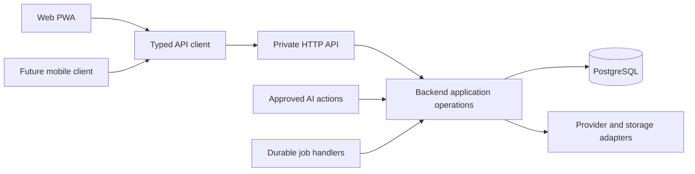

# Noola code structure and architecture review

**Status:** Draft mechanisms for Nishanth to review. Researched and exercised on 4 October 2026; frontend recommendations revised for the owner's explicit library choices. Backend/client separation, TanStack Router, shadcn/Base UI, TanStack Form and nuqs are established directions. Other libraries, folder layout and additional performance targets remain recommendations. Canonical documents reflect those directions; this review does not approve the full architecture. The [Noola skill](../../.agents/skills/noola-code-structure/SKILL.md) now owns code placement and coding standards.

Recommend a small pnpm workspace containing a web application, an independently built backend, shared API contracts and a reusable client library. Keep business operations in a modular backend with one PostgreSQL database. Use a schema-defined private HTTP API with generated TypeScript client types and runtime validation. Start with a shared browser origin and a simple deployment on an already permitted host; independent builds allow the backend to move or scale without rewriting business operations.

The preferred backend candidate is Hono on Node, Zod and OpenAPI, with openapi-typescript and openapi-fetch for the TypeScript client. TanStack Router supplies navigation for the proposed Vite SPA, and TanStack Query owns the client server-state cache. shadcn/Base UI, TanStack Form and nuqs supply the selected UI/form/URL foundation, reviewed in the [TanStack analysis](TANSTACK-AND-UI-REVIEW.md). Backend experiments below do not validate the new frontend integrations or production readiness.

## What exists and what changes

The repository contains product requirements, architectural proposals, ADRs, acceptance scenarios and a documentation checker. There is no application manifest, implemented backend, UI, application CI or deployed service to refactor. These changes revise planned structure without a code migration.

The [architecture](../ARCHITECTURE.md), [application structure ADR](../adr/001-application-structure.md), [stack](../TECH-STACK.md) and [operations](../reference/OPERATIONS.md) now describe independent web/backend units and explicit client contracts. Domain ownership, PostgreSQL transactions, PWA evaluation, permitted hosting, product rights and lifecycle rules continue to constrain the revised design. Owner frontend choices are accepted in ADR-013; remaining backend/packaging mechanisms are proposed.

| Concern | Proposed change | Reason |
|---|---|---|
| Packaging | Two application packages and two shared packages in one pnpm workspace | Backend and web builds can be released independently |
| Web rendering | TanStack Router with a Vite SPA | A private PWA can call the backend directly and deploy as static assets |
| Backend transport | Hono with a Node adapter | Small typed HTTP integration with schema-driven OpenAPI |
| API contract | Shared Zod schemas and route descriptions; generated OpenAPI and client declarations | One reviewed definition supplies server and client shapes |
| Client data | TanStack Query with explicit privacy and retry settings | One owner for deduplication, pagination, invalidation and pending state |
| UI reuse | Shared components inside the web app initially | Reuse now without creating a speculative cross-platform UI package |
| UI/forms/URL | shadcn with Base UI, TanStack Form and nuqs | Explicit owner selection with one owner per state category |

TanStack Router provides typed routing and loader coordination for a client-rendered Vite app without requiring TanStack Start. SSR can be reconsidered if first-load measurements justify it; a future rendering server would call the same backend rather than host duplicate operations. [TanStack Router](https://tanstack.com/router/latest), [external data loading](https://tanstack.com/router/latest/docs/guide/external-data-loading).

## Options researched

The following assessments combine documented capabilities with Noola-specific engineering judgment. No framework throughput comparison was run.

| Option | Fit for Noola | Finding and recommendation |
|---|---|---|
| Hono plus Zod OpenAPI and generated client | Explicit HTTP boundary, reusable TypeScript client and a language-neutral specification | Preferred candidate. Requires explicit response validation and a generation step; limited strict compilation and HTTP experiment passed |
| oRPC with contract-first OpenAPI | Strong match for inputs, outputs, typed errors, query integration and client separation | Good alternative in principle. Stable 1.15.4 failed a full dependency declaration check in this environment; runtime and application typing passed with dependency declaration checking skipped |
| ts-rest | Contract-first HTTP APIs with Express and query integrations | Stable 3.52.1 peers require Zod 3 and Express 4; the React query adapter excludes React 19. The relevant newer support is in an RC, conflicting with the proposed stable Zod 4 and React 19 stack |
| tRPC | Convenient inference for TypeScript clients and standalone server adapters | Credible if every client is TypeScript. Native OpenAPI interoperability is not the main design demonstrated by the reviewed core documentation, making it less direct for an unspecified future mobile language |
| Integrated web server operations only | Few initial packages and convenient web forms | Does not satisfy the requested independently consumable backend boundary |

Hono documents schema-validated routes and OpenAPI generation, Node hosting, and Better Auth has a maintained Hono integration. These establish available integration paths; production authentication still needs the application's own tests. [Hono Zod OpenAPI](https://hono.dev/examples/zod-openapi), [Hono Node adapter](https://hono.dev/docs/getting-started/nodejs), [Better Auth Hono integration](https://better-auth.com/docs/integrations/hono).

oRPC provides contract definitions, runtime implementation enforcement and generated OpenAPI. The main documentation currently targets its beta generation, while stable v1 documentation is available separately. Use documentation matching the adopted major. [oRPC v1 contracts](https://v1.orpc.dev/docs/contract-first/define-contract), [implementation](https://v1.orpc.dev/docs/contract-first/implement-contract), [OpenAPI generation](https://v1.orpc.dev/docs/openapi/openapi-specification).

ts-rest's quickstart explicitly labels Zod 4 support as an RC. Exact stable peer constraints were also inspected in the npm registry, rather than inferred from examples. [ts-rest quickstart](https://ts-rest.com/quickstart), [stable core metadata](https://registry.npmjs.org/@ts-rest/core/3.52.1), [Express metadata](https://registry.npmjs.org/@ts-rest/express/3.52.1), [query adapter metadata](https://registry.npmjs.org/@ts-rest/react-query/3.52.1).

tRPC supports input and output validators; inferred return types alone do not supply runtime output validation. openapi-fetch derives request, response and error types from generated OpenAPI declarations, but runtime response validation must be supplied separately. [tRPC validators](https://trpc.io/docs/server/validators), [openapi-fetch](https://openapi-ts.dev/openapi-fetch/).

## Deployment and scaling



For a mobile client written in another language, replace the TypeScript client box with a client generated or implemented against the same OpenAPI document. Server behavior and policy remain shared. The diagram does not imply that every background job calls an HTTP endpoint: backend jobs call application operations directly.

Build the web and backend separately from the first scaffold. Initially the backend may serve the already built static web assets on the permitted VM, or both builds may run behind one reverse proxy on the same permitted host. Neither arrangement should make the backend build import web source. A packaging task assembles artifacts after both independent builds succeed.

Use one browser origin with `/api/v1` for product operations and `/api/auth` for maintained authentication. The same origin can later proxy to an independently hosted backend. This avoids an unnecessary first-stage cross-origin cookie arrangement and preserves the web origin used by installed PWAs. If browser origins are intentionally separated, configure explicit credentialed CORS, trusted origins, cookies and CSRF behavior and validate both actual phones. Authentication library CSRF protections for its own routes do not automatically cover every application mutation.

Keep sessions, permissions, receipts, deduplication, cost reservations and due-work state in authoritative storage. In-process caches and timers cannot become their sole owners. API replicas need bounded database pools, atomic concurrency handling, current session checks and graceful shutdown. Use one migration job for a release rather than allowing every replica to migrate on startup.

Horizontal scaling has real prerequisites. Retained files on one host need an allowed shared-storage or explicit routing design before arbitrary replicas can serve them. The independent restriction journal and recovery arrangement still apply. CPU-intensive parsing needs isolation from interactive requests; pg-boss handlers need bounded ownership and reconciliation. Separating the API does not remove these constraints.

Start by measuring on one backend instance, then scale vertically, separate workers when actual contention or execution limits require it, and add API replicas after the state and storage prerequisites pass. All deployments stay within the [permitted hosting and budget contracts](../reference/OPERATIONS.md#deployment). Multi-region operation, service meshes, Kubernetes and a database per domain have no present requirement.

## Code placement guidance

Use the repository's [noola-code-structure skill](../../.agents/skills/noola-code-structure/SKILL.md) for workspace paths, module files, shared UI, naming and coding conventions. [Root agent instructions](../../AGENTS.md) require loading it before source/setup work. This review supplies rationale and contract experiments; it does not maintain a second folder specification.

## Backend module responsibilities

Operations, domain policy, owned persistence and provider mechanics have different responsibilities. The skill describes their code placement and extraction criteria; apply those conventions to the actual task rather than generating a full hierarchy for each domain.

| Code location | Responsibility | Boundary |
|---|---|---|
| HTTP binding | Validate transport input, establish request context, call an operation, map a response | Contains no separate implementation of product workflow rules |
| Application operation | Coordinate current rights, domain behavior, transactions, receipts and external-work admission | Callable from HTTP, approved AI coordination and jobs |
| Domain policy | Own valid states and transitions for its records | Does not import HTTP context objects, browser state or provider SDK shapes |
| Owned repository | Execute typed, parameterized persistence in the operation's transaction | Does not mutate another module's records behind its interface |
| Provider adapter | Perform bounded external mechanics and report normalized outcomes | Cannot independently approve spending, grant access or invent a committed result |

An operation receives a server-established principal/context. An incoming `ownerId` or model-produced identity does not establish authority. Recheck the rights relevant to the operation and each external effect according to the canonical [application contracts](../reference/APPLICATION-DESIGN.md#module-contracts).

For a shared-list addition, manual UI and approved AI coordination call the same list operation. It checks current rights, binds the command to its submission reference, handles an expected revision, commits the item and receipt together, and returns the authoritative result. The web client may display optimistic pending state; it does not announce a committed save before the receipt. A job delegates through the same domain boundaries.

Provider adapters normalize technical failures such as rejection, timeout and unknown submission. The owning operation decides retry, reconciliation and user-visible meaning. A timeout after submission is not proof that nothing happened. A later worker extraction should move shared backend modules into a server-only package when a separately built worker actually needs them.

## Type safety across every boundary

The target is checked types from persistence through operations, API projection, network response, client query and component props, with runtime validation wherever values come from outside trusted code.

```text
Database schema and constraints
  -> typed owned repository
  -> typed application result
  -> explicit public response projection and runtime schema
  -> HTTP JSON
  -> generated client types and runtime response validation
  -> typed query data
  -> typed component props
```

1. Define transport schemas once in the contracts package. Infer TypeScript shapes from them and generate OpenAPI from their route associations. Do not hand-maintain another set of frontend request/response interfaces.
2. Validate parameters, query strings, request bodies, environment configuration, provider responses and model output. Valid JSON is not sufficient to establish the expected shape.
3. Select permitted database fields and construct explicit response projections. Database rows, session records and provider responses are not API responses. Output validation is a second defense against accidental fields and wrong values.
4. Bind backend handlers to the declared request and response types. With the preferred candidate, input validation is supplied by the route integration; output validation must be deliberately called or provided by the binding helper.
5. Generate TypeScript declarations for openapi-fetch from OpenAPI. Add one client middleware that validates response status and shape using the same schema associations. The generated types alone do not check received JSON.
6. Feed the inferred response through query definitions into component props. Components use discriminated pending, success, conflict, denied and unknown states where those distinctions matter.
7. Use strict TypeScript, unchecked-index and exact-optional-property checks. Treat external values as `unknown` until parsed; constrain type assertions and suppressions to reviewed, justified boundaries. Formatting does not perform these checks.

Use portable JSON representations at the API boundary: UTC timestamp strings plus intended timezone where needed, explicit revisions, strings for values that cannot safely fit JavaScript numbers, and deliberate absent-versus-null meanings. Keep output schemas free of transformations that make the accepted wire shape differ from the documented shape. File bytes and progress streams need their own transport contracts when those phases begin.

Type checking cannot prove authorization, receipt truth, race handling or compatibility between independently deployed versions. Test those behaviors. Version the private HTTP boundary as `/api/v1`; prefer additive response changes, deliberate defaults and tolerant readers where safe. Breaking field, enum, status or semantic changes need a coordinated upgrade or a new version. Old installed clients may remain active after a backend release; compile-time agreement within the workspace is insufficient.

## Reuse across web and future mobile

| Kind of logic | Reuse strategy |
|---|---|
| Rights, consent, approvals, budgets, scheduling, persistence and lifecycle | Implement once in the backend and call its API |
| API request, response and error definitions | Share schemas and the generated language-neutral specification |
| Fetch, response validation and query definitions | Reuse the TypeScript client for a compatible TypeScript mobile app |
| Pure formatting and presentation calculations | Extract a small shared module when a second client actually needs it |
| Web form controls and composed components | Reuse the web components inside the web app |
| Native controls, navigation, capture and notifications | Implement with the platform's components and integrate the common backend |

React Native can reuse suitable TypeScript client code; Swift, Kotlin or Dart clients can use the OpenAPI specification. This does not promise that a generated SDK implements all authentication, binary upload or streaming details correctly. Those need a mobile acceptance experiment once the platform is selected. Better Auth documents Expo integration with secure storage and configurable session caching; the eventual client must preserve Noola's lock and clearing policies. [Better Auth Expo integration](https://better-auth.com/docs/integrations/expo).

Native and DOM components have different implementation constraints. Reuse tokens, meaning, validation and backend behavior without forcing identical rendering code. Delay `apps/mobile`, a shared UI package and a shared backend package until their actual consumers exist.

## UI composition and responsiveness

Use the selected shadcn/Base UI and Tailwind foundation. Commit Base UI configuration and reviewed generated components; define tokens for spacing, color, typography, radii, focus and motion. Follow actual Base UI composition APIs. A shared button exposes typed variants, pending/disabled state and accessible labeling; it does not fetch records or contain authorization policy. The [frontend review](TANSTACK-AND-UI-REVIEW.md) covers full library selection and validation.

Build reuse at three levels: UI primitives, recurring patterns such as form fields and empty/error states, and feature components such as an audience picker or reviewed-action receipt. Routes compose these pieces. A record editor takes typed values and callbacks, allowing the same editor to appear on a screen or in a dialog. Keep a component local until its repeated meaning is clear; avoid a generic page driven by dozens of flags.

Accessibility and visual consistency must be validated in browser flows, including keyboard focus, 200% text, long Tamil labels, loading, conflict, denied and failed states. Prefer local preview routes and Playwright initially; add a component catalog tool only if maintaining a large isolated component inventory warrants it. The source [UI ADR](../adr/013-accessible-ui.md) remains the foundation.

For speed, split routes, avoid fetching unrelated records, run independent reads concurrently, use bounded pagination, cancel obsolete requests and keep CPU-heavy work away from the API event loop. Load parsers and large editors only where needed. Prefer transport-size and actual-device measurements over framework microbenchmarks. Expose safe pending state immediately and keep AI processing out of the ordinary manual path.

Propose TanStack Query as the single client owner of server state. Router loaders prime the same query definitions and retain no separate record payload. TanStack Form owns unsent editable values; nuqs owns approved URL presentation state, using the same parser map for Router validation; React owns dialog/capture interactions. Store requires shared client-only state not already covered by those owners. The experimental nuqs adapter requires real browser integration checks.

Query defaults require deliberate configuration. Scope cache identity to the current principal and household, cancel pending reads, dispose cached private data on logout, lock, account switch and revocation handling, and guard late responses from a previous session generation. Revalidate authority on resume and before redisplaying protected content. Do not persist private query data in localStorage, IndexedDB or the service worker. Content reuse within an authorized session is distinct from caching permission decisions.

Queries may retry selected transient reads with bounds; authorization and schema failures should not be retried. Start mutations with retry disabled. An explicit retry keeps the same submission reference and reconciles unknown outcomes; generic offline replay is excluded. TanStack Query documents automatic stale-data refetching, inactive-cache retention and query retry defaults, which need adjustment for this application. [TanStack Query defaults](https://tanstack.com/query/latest/docs/framework/react/guides/important-defaults).

Existing [acceptance targets](../reference/ACCEPTANCE.md#quality-and-evaluation) remain authoritative, including local feedback within one second, actionable progress within five seconds and at least 95% of manual operations within two seconds. As additional review targets, measure LCP at most 2.5 seconds, INP at most 200 ms and CLS at most 0.1 at the 75th percentile, separated for phones and desktop. These are proposed UI targets, not amendments to the current acceptance table or measured results. A household pilot supplies too few users for claims of broad population performance; retain device measurements and synthetic network profiles. [Web Vitals thresholds and percentiles](https://web.dev/articles/vitals).

## Agent guidance and checks

The created root `AGENTS.md` routes source/setup work to the Noola skill. The skill owns placement, reuse and coding conventions; canonical documents retain system boundaries, technology choices and product contracts. Generation, import-boundary and build checks below remain planned tooling until implemented.

At scaffold time, implement a shared check command that runs pinned Biome, separate TypeScript checks, contract generation/drift checking, dependency-boundary checking, relevant tests and builds. Browser and real-phone evidence apply when a user flow exists. Check both independent package builds and a client bundle for accidental server dependencies.

Use an import graph checker such as dependency-cruiser for architecture rules, with aliases resolved and violations treated as errors. This is a narrow addition for boundaries, not another formatter. It supports forbidden dependencies and cycle checks. [Dependency-cruiser rule documentation](https://github.com/sverweij/dependency-cruiser/blob/main/doc/rules-reference.md).

Enforce these boundaries: clients cannot import backend source or database/provider packages; contracts cannot import either application; backend cannot depend on web; domain code cannot depend on transport contexts; cross-module access uses public owner interfaces; shared UI primitives cannot import feature-specific data operations. Generated files are derived artifacts and must not be hand-edited. Required CI checks and review must be configured to block merging, including review of changes that weaken those checks.

## Experiments and their limits

Both experiments used synthetic data, loopback HTTP, temporary directories and pinned dependencies installed with lifecycle scripts disabled. Nothing contacted an AI provider or deployed a service. npm was used only as an isolated experiment harness; the recommended project package manager remains pnpm. [Recorded versions and results](code-structure-evidence.json).

| Experiment | Observed result | Limit |
|---|---|---|
| oRPC 1.15.4, Zod 4, Express 5, TypeScript 7 | HTTP requests, server validation, typed query options and OpenAPI generation passed when `skipLibCheck` was enabled | Full declaration checking failed due to published compression types referencing a publisher path and an absent optional telemetry type dependency |
| oRPC interop 1.15.3 and 1.15.2 published declarations | Same absolute compression declaration path observed in the downloaded tarballs | Those full older dependency sets were not installed or runtime-tested |
| Hono, Zod OpenAPI, generated openapi-fetch client | Strict application and dependency declaration checks passed with `skipLibCheck: false`; ten HTTP/presentation checks passed | Synthetic principal checks and in-memory records do not establish production authentication, transactions, races or performance |

The Hono experiment rejected wrong input types and an injected ownership field before execution, checked output shape, excluded an internal field, delivered typed error responses, rejected malformed successful responses on the client, and used two client instances against one backend operation. Negative compile fixtures verified that missing fields, wrong value types, unknown API paths and internal output fields produce type errors. Presentation was a typed TypeScript function, not a rendered React interface.

The OpenAPI generator's stable peer currently requires TypeScript 5.x. The experiment selected compatible 5.9.3 after strict peer installation rejected 7.0.2, and added the missing generator declaration dependencies `json-schema-to-ts` and `@types/js-yaml`. It did not ignore incompatible peers. These are build-tool dependency findings to revalidate at scaffold time, not reasons to keep an incompatible application compiler indefinitely. [Generator metadata](https://registry.npmjs.org/openapi-typescript/7.13.0).

oRPC's declaration problem should be resolved or deliberately assessed before adoption. `skipLibCheck` skips declaration checking and has an accuracy tradeoff, even though application source still gets checked. [TypeScript explanation](https://www.typescriptlang.org/tsconfig/skipLibCheck.html). This experiment does not establish a runtime defect or security vulnerability in oRPC.

## Implementation sequence and review decisions

1. Review the remaining four-package, SPA delivery, schema-defined HTTP API, Hono and query-cache recommendations. Owner frontend directions are already recorded. Native platform choice and worker separation wait for their triggers.
2. Keep canonical architecture, stack, application/auth contracts and operations aligned as remaining recommendations are accepted. The 4 October frontend update has reconciled current directions; preserve product policy and stable identifiers rather than treating this review as a parallel rulebook.
3. Use and maintain the created Noola code-structure skill. It links current canonical decisions and distinguishes proposed checks from implemented tooling; update it as setup and actual validation proceed.
4. Scaffold the workspace, independent builds, compatible stable pins, Biome, TypeScript, import checks and development services. Retain synthetic fixtures and fake providers. Confirm the backend runs with no web source or browser environment.
5. Implement one authenticated private note or list flow as the first architectural proof: policy, real PostgreSQL transaction, typed contract, validated response, Query, TanStack Form and reusable shadcn/Base UI editor. Validate Router/nuqs history and query integration; exercise approved-action coordination when enabled.
6. Validate two independent clients, incompatible input/output, cross-member isolation, replay/concurrent edits, old-client compatibility, logout/lock clearing and package/bundle boundaries. Measure real UI behavior on both phones. Run a backend build/deployment independently of the web and verify an old installed web build against the new backend.

Architecture acceptance requires independent builds, one source for API shapes, runtime checks on both sides, reusable backend operations, deliberate component reuse, passing privacy/concurrency tests and measured responsiveness. The limited experiments prove availability of a viable contract approach; the first vertical feature must prove its fit with Noola's actual identity, persistence and UI behavior.
